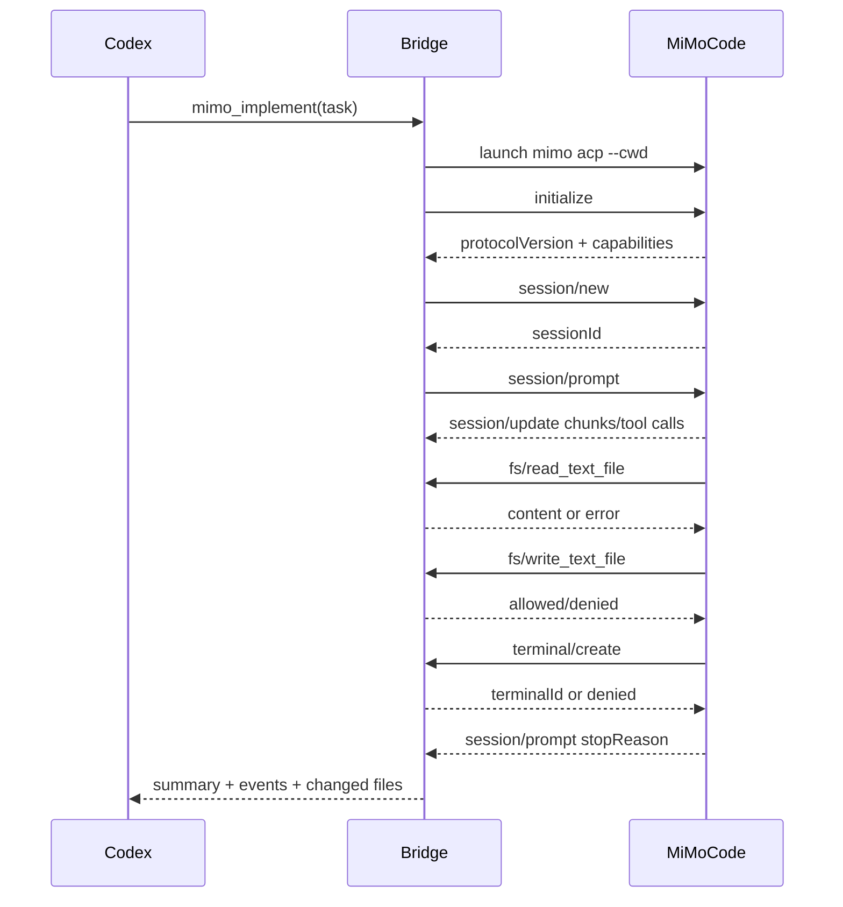

# Codex-MiMo ACP Integration Implementation Plan

> **For agentic workers:** REQUIRED SUB-SKILL: Use superpowers:subagent-driven-development (recommended) or superpowers:executing-plans to implement this plan task-by-task. Steps use checkbox (`- [ ]`) syntax for tracking.

**Goal:** Build a practical bridge that lets Codex invoke MiMoCode during software development, first through a script-based MVP and then through a Codex plugin that drives MiMoCode over ACP.

**Architecture:** Codex remains the orchestrator and reviewer. MiMoCode is treated as a specialist coding agent. The MVP invokes `mimo run --format json` for fast validation; the production path implements an ACP client bridge that launches `mimo acp`, manages sessions, handles file/terminal requests, enforces policy, and exposes high-level tools to Codex.

**Tech Stack:** Node.js/TypeScript, MiMoCode CLI, ACP JSON-RPC over stdio, Codex plugin MCP server, JSONL logs, local policy config, Git-based diff verification.

---

## 1. Background And Scope

MiMoCode currently provides two useful integration surfaces:

- `mimo run [message ..]`: non-interactive execution, supports `--format json`, `--agent`, `--model`, `--session`, `--continue`, `--fork`, `--file`, `--attach`, and `--dangerously-skip-permissions`.
- `mimo acp`: ACP agent entry point, supports `--cwd`, `--port`, and `--hostname`.

ACP is a JSON-RPC protocol between a client and an agent. A client initializes the agent, creates or resumes a session, sends prompts, receives streaming updates, and responds to agent requests such as permission checks, file reads/writes, and terminal execution.

This project should produce:

1. A script MVP named `codex-mimo` that Codex can call during development.
2. A reusable ACP bridge library.
3. A Codex plugin that exposes MiMoCode as tools such as `mimo_plan`, `mimo_implement`, and `mimo_review`.
4. A security model that prevents MiMoCode from writing outside the project or running dangerous commands by default.

Non-goals for the first release:

- Do not implement a full UI.
- Do not replace Codex's planning and verification loop.
- Do not enable unconditional shell execution.
- Do not require MiMoCode source modification.

---

## 2. Recommended Repository Layout

Create the project under `E:\ideaProjects\codex-mimo`.

```text
codex-mimo/
  README.md
  package.json
  tsconfig.json
  vitest.config.ts
  .gitignore
  doc/
    codex-mimo-acp-integration-plan.md
    policy-guide.md
    acp-message-flow.md
  src/
    cli/
      main.ts
      commands.ts
      output.ts
    core/
      config.ts
      errors.ts
      logger.ts
      paths.ts
      policy.ts
      prompt.ts
      sessions.ts
    mimo/
      run-json.ts
      acp-client.ts
      acp-process.ts
      acp-types.ts
      acp-updates.ts
    codex/
      mcp-server.ts
      tools.ts
      tool-schemas.ts
    git/
      diff.ts
      status.ts
    test/
      fixtures/
        acp/
        mimo-run/
      unit/
        policy.test.ts
        paths.test.ts
        run-json.test.ts
        acp-client.test.ts
      integration/
        codex-mimo-cli.test.ts
```

### File Responsibilities

- `src/cli/main.ts`: CLI entry point for `codex-mimo`.
- `src/cli/commands.ts`: maps CLI subcommands to core workflows.
- `src/cli/output.ts`: prints human-readable or JSON output.
- `src/core/config.ts`: loads project config from `codex-mimo.config.json`.
- `src/core/policy.ts`: evaluates file and terminal permissions.
- `src/core/paths.ts`: normalizes and validates absolute paths.
- `src/core/prompt.ts`: builds prompts for plan, implement, review, and fix-ci workflows.
- `src/core/sessions.ts`: stores MiMoCode session IDs and metadata.
- `src/mimo/run-json.ts`: wraps `mimo run --format json`.
- `src/mimo/acp-client.ts`: JSON-RPC ACP client.
- `src/mimo/acp-process.ts`: starts and supervises `mimo acp`.
- `src/mimo/acp-types.ts`: local ACP TypeScript types for methods used by this bridge.
- `src/mimo/acp-updates.ts`: converts ACP updates into Codex-friendly events.
- `src/codex/mcp-server.ts`: MCP server exposed by the Codex plugin.
- `src/codex/tools.ts`: high-level tools such as `mimo_plan` and `mimo_implement`.
- `src/codex/tool-schemas.ts`: input schemas for Codex-facing tools.
- `src/git/diff.ts`: captures before/after diffs.
- `src/git/status.ts`: captures dirty worktree state.

---

## 3. Product Design

Codex should not hand over the entire task blindly. The intended collaboration model is:

1. Codex receives the user's development request.
2. Codex determines whether MiMoCode is useful.
3. Codex calls MiMoCode for specialized codebase work.
4. MiMoCode proposes or applies changes.
5. Codex verifies, reviews, and reports the outcome.

### Roles

| Role | Responsibility |
| --- | --- |
| User | Defines product intent and approves risky operations |
| Codex | Orchestrates task, validates outputs, runs final verification |
| Codex-MiMo bridge | Translates Codex tool calls into MiMoCode CLI/ACP interactions |
| MiMoCode | Explores repo, plans code changes, edits files, runs narrow checks |
| Policy layer | Controls paths, commands, permissions, and session scope |

### Workflows

| Workflow | First implementation | Production implementation |
| --- | --- | --- |
| Plan | `mimo run --agent plan --format json` | ACP `session/prompt` with plan mode |
| Implement | `mimo run --agent build --format json` | ACP session with fs/terminal policy enforcement |
| Review | `mimo run --agent plan --format json` with git diff prompt | ACP prompt with embedded diff/resource |
| Fix CI | `mimo run --file ci.log --format json` | ACP prompt with CI log resource |
| Resume | `mimo run --session <id>` | ACP `session/load` or `session/resume` when supported |

---

## 4. Security Model

The bridge must be conservative by default. There are two layers of protection:

1. MiMoCode permission configuration.
2. Bridge-side policy enforcement.

The bridge-side policy is mandatory because ACP allows the agent to request client filesystem and terminal operations.

### Default Policy

```jsonc
{
  "workspaceRoot": "E:/ideaProjects/codex-mimo",
  "fileAccess": {
    "read": ["${workspaceRoot}/**"],
    "write": ["${workspaceRoot}/**"],
    "deny": [
      "**/.env",
      "**/.env.*",
      "**/id_rsa",
      "**/id_ed25519",
      "**/.npmrc",
      "**/.pypirc"
    ]
  },
  "terminal": {
    "allow": [
      "git status*",
      "git diff*",
      "git log*",
      "npm test*",
      "npm run test*",
      "npm run lint*",
      "npm run typecheck*",
      "pnpm test*",
      "pnpm lint*",
      "pnpm typecheck*"
    ],
    "ask": [
      "npm install*",
      "pnpm install*",
      "npm run build*",
      "pnpm build*"
    ],
    "deny": [
      "rm *",
      "del *",
      "Remove-Item *",
      "git push*",
      "git reset*",
      "git checkout --*",
      "curl *",
      "wget *",
      "ssh *",
      "scp *"
    ]
  },
  "network": {
    "default": "deny"
  }
}
```

### Permission Decisions

| Request | Default outcome |
| --- | --- |
| Read file under workspace | allow |
| Read `.env` or secret-like file | deny |
| Write file under workspace | ask in interactive mode, deny in CI unless explicitly enabled |
| Write outside workspace | deny |
| Run tests/lint/typecheck | allow |
| Install packages | ask |
| Push/reset/delete | deny |
| Network fetch | deny unless workflow explicitly enables it |

### Required Audit Events

Every invocation should write a JSONL audit log:

```json
{"type":"session_start","workflow":"implement","cwd":"E:/project/app","agent":"build"}
{"type":"permission","operation":"terminal","command":"npm test","outcome":"allow"}
{"type":"file_write","path":"E:/project/app/src/login.ts","bytes":940}
{"type":"session_end","stopReason":"end_turn","changedFiles":["src/login.ts"]}
```

---

## 5. CLI MVP Specification

The MVP CLI should be useful even before ACP is fully implemented.

### Commands

```bash
codex-mimo healthcheck
codex-mimo plan "Add login rate limiting"
codex-mimo implement "Fix failing user-session test"
codex-mimo review --since HEAD
codex-mimo fix-ci --file ./ci.log
codex-mimo resume --session <mimo-session-id> "Continue the previous task"
```

### CLI Options

```text
--cwd <path>              Project root. Defaults to process cwd.
--agent <name>            MiMoCode agent. Defaults by workflow.
--model <provider/model>  Optional model override.
--json                    Output machine-readable JSON.
--dry-run                 Build and print the MiMoCode command without executing it.
--session <id>            Continue a MiMoCode session.
--fork                    Fork the session when continuing.
--allow-write             Allow MiMoCode to write files.
--allow-install           Allow package install commands.
--log-dir <path>          Directory for JSONL logs.
```

### Command Mapping

`plan` should call:

```bash
mimo run --format json --agent plan --title "codex-mimo plan" "<prompt>"
```

`implement` should call:

```bash
mimo run --format json --agent build --title "codex-mimo implement" "<prompt>"
```

`review` should call:

```bash
git diff --stat HEAD
git diff HEAD
mimo run --format json --agent plan --title "codex-mimo review" "<prompt with diff summary>"
```

`fix-ci` should call:

```bash
mimo run --format json --agent build --file ./ci.log --title "codex-mimo fix-ci" "<prompt>"
```

### Prompt Template: Plan

```text
You are being invoked by Codex as a specialist MiMoCode planning agent.

Task:
{user_task}

Rules:
- Do not edit files.
- Inspect only the code needed for this task.
- Produce a concise implementation plan with touched files, risks, and verification commands.
- Prefer the smallest change that satisfies the request.
- If the task is ambiguous, state assumptions instead of broadening scope.
```

### Prompt Template: Implement

```text
You are being invoked by Codex as a specialist MiMoCode implementation agent.

Task:
{user_task}

Rules:
- Keep changes surgical.
- Do not modify unrelated files.
- Do not commit, push, reset, or delete files.
- Run the narrowest meaningful verification when practical.
- Return changed files, commands run, results, and remaining risks.
```

### Prompt Template: Review

```text
You are being invoked by Codex as a specialist MiMoCode review agent.

Review the current diff:
{diff_summary}

Rules:
- Do not edit files.
- Prioritize correctness bugs, regressions, security, and missing tests.
- Give file and line references when available.
- If no issues are found, say that clearly and mention residual risk.
```

---

## 6. ACP Bridge Specification

The ACP bridge is the production integration layer. It should run MiMoCode as a subprocess:

```bash
mimo acp --cwd <absolute-project-root>
```

### Minimum ACP Lifecycle



### Initialization Request

```json
{
  "jsonrpc": "2.0",
  "id": 1,
  "method": "initialize",
  "params": {
    "protocolVersion": 1,
    "clientCapabilities": {
      "fs": {
        "readTextFile": true,
        "writeTextFile": true
      },
      "terminal": true
    },
    "clientInfo": {
      "name": "codex-mimo",
      "title": "Codex MiMoCode Bridge",
      "version": "0.1.0"
    }
  }
}
```

### Session New Request

```json
{
  "jsonrpc": "2.0",
  "id": 2,
  "method": "session/new",
  "params": {
    "cwd": "E:/ideaProjects/example-app",
    "mcpServers": []
  }
}
```

### Prompt Request

```json
{
  "jsonrpc": "2.0",
  "id": 3,
  "method": "session/prompt",
  "params": {
    "sessionId": "sess_abc123",
    "prompt": [
      {
        "type": "text",
        "text": "Fix the failing user-session test. Keep changes surgical."
      }
    ]
  }
}
```

### Client-Side Request Handlers

The bridge must handle these agent-to-client requests:

| ACP method | Bridge behavior |
| --- | --- |
| `session/request_permission` | Evaluate policy, auto-allow safe operations, reject dangerous operations, optionally ask user in interactive mode |
| `fs/read_text_file` | Normalize path, verify it is allowed, return content |
| `fs/write_text_file` | Normalize path, verify write permission, write content, record audit event |
| `terminal/create` | Normalize cwd, validate command, start process, return terminal ID |
| `terminal/output` | Return captured stdout/stderr and exit status |
| `terminal/wait_for_exit` | Await process completion with timeout |
| `terminal/kill` | Stop process |
| `terminal/release` | Stop if still running, release resources |

### Event Conversion

ACP `session/update` events should become Codex-MiMo events:

```ts
type CodexMimoEvent =
  | { type: "message"; role: "agent" | "user"; text: string; messageId?: string }
  | { type: "plan"; entries: Array<{ content: string; status: string; priority?: string }> }
  | { type: "tool"; id: string; title: string; kind: string; status: string }
  | { type: "diff"; path: string; oldText?: string | null; newText: string }
  | { type: "terminal"; id: string; output: string; exitCode?: number | null }
  | { type: "usage"; used: number; size: number; cost?: { amount: number; currency: string } };
```

---

## 7. Codex Plugin Specification

The plugin should expose a local MCP server to Codex.

### Plugin Layout

```text
codex-mimocode-plugin/
  .codex-plugin/
    plugin.json
  .mcp.json
  package.json
  src/
    server.ts
    tools/
      healthcheck.ts
      plan.ts
      implement.ts
      review.ts
      fix-ci.ts
      resume.ts
    bridge/
      index.ts
```

### MCP Tool Surface

#### `mimo_healthcheck`

Input:

```json
{
  "cwd": "E:/ideaProjects/example-app"
}
```

Output:

```json
{
  "ok": true,
  "mimoPath": "C:/Users/Administrator/AppData/Roaming/npm/mimo.cmd",
  "version": "x.y.z",
  "authConfigured": true,
  "supportsAcp": true
}
```

#### `mimo_plan`

Input:

```json
{
  "cwd": "E:/ideaProjects/example-app",
  "task": "Add login rate limiting",
  "agent": "plan",
  "model": "mimo/mimo-v2.5-pro"
}
```

Output:

```json
{
  "summary": "Plan created.",
  "events": [],
  "sessionId": "sess_abc123",
  "changedFiles": [],
  "verification": []
}
```

#### `mimo_implement`

Input:

```json
{
  "cwd": "E:/ideaProjects/example-app",
  "task": "Fix failing user-session test",
  "allowWrite": true,
  "allowInstall": false
}
```

Output:

```json
{
  "summary": "Implementation completed.",
  "sessionId": "sess_abc123",
  "changedFiles": ["src/session.ts", "test/session.test.ts"],
  "commands": [
    {
      "command": "npm test -- session.test.ts",
      "exitCode": 0
    }
  ],
  "risks": []
}
```

#### `mimo_review`

Input:

```json
{
  "cwd": "E:/ideaProjects/example-app",
  "base": "HEAD"
}
```

Output:

```json
{
  "findings": [
    {
      "severity": "medium",
      "file": "src/session.ts",
      "line": 42,
      "message": "Token expiry check does not cover clock skew."
    }
  ],
  "summary": "One medium issue found."
}
```

---

## 8. Implementation Tasks

### Task 1: Initialize TypeScript Project

**Files:**

- Create: `package.json`
- Create: `tsconfig.json`
- Create: `vitest.config.ts`
- Create: `.gitignore`

- [ ] **Step 1: Create `package.json`**

```json
{
  "name": "codex-mimo",
  "version": "0.1.0",
  "private": true,
  "type": "module",
  "bin": {
    "codex-mimo": "./dist/cli/main.js"
  },
  "scripts": {
    "build": "tsc -p tsconfig.json",
    "test": "vitest run",
    "test:watch": "vitest",
    "lint": "tsc -p tsconfig.json --noEmit"
  },
  "dependencies": {
    "execa": "^9.5.2",
    "minimatch": "^10.0.1",
    "zod": "^3.24.1"
  },
  "devDependencies": {
    "@types/node": "^22.10.2",
    "typescript": "^5.7.2",
    "vitest": "^2.1.8"
  }
}
```

- [ ] **Step 2: Create `tsconfig.json`**

```json
{
  "compilerOptions": {
    "target": "ES2022",
    "module": "NodeNext",
    "moduleResolution": "NodeNext",
    "strict": true,
    "declaration": true,
    "outDir": "dist",
    "rootDir": "src",
    "esModuleInterop": true,
    "forceConsistentCasingInFileNames": true,
    "skipLibCheck": true
  },
  "include": ["src/**/*.ts"]
}
```

- [ ] **Step 3: Create `vitest.config.ts`**

```ts
import { defineConfig } from "vitest/config";

export default defineConfig({
  test: {
    include: ["test/**/*.test.ts"],
    environment: "node"
  }
});
```

- [ ] **Step 4: Create `.gitignore`**

```text
node_modules/
dist/
.codex-mimo/
*.log
```

- [ ] **Step 5: Verify project skeleton**

Run:

```bash
npm install
npm run build
```

Expected:

```text
No TypeScript errors after source files are added in later tasks.
```

### Task 2: Implement Path Policy

**Files:**

- Create: `src/core/paths.ts`
- Create: `src/core/policy.ts`
- Test: `test/unit/policy.test.ts`

- [ ] **Step 1: Create path helpers**

```ts
// src/core/paths.ts
import path from "node:path";

export function normalizePath(input: string): string {
  return path.resolve(input).replace(/\\/g, "/");
}

export function isPathInside(parent: string, child: string): boolean {
  const normalizedParent = normalizePath(parent);
  const normalizedChild = normalizePath(child);
  return (
    normalizedChild === normalizedParent ||
    normalizedChild.startsWith(`${normalizedParent}/`)
  );
}
```

- [ ] **Step 2: Create policy evaluator**

```ts
// src/core/policy.ts
import { minimatch } from "minimatch";
import { isPathInside, normalizePath } from "./paths.js";

export type Decision = "allow" | "ask" | "deny";

export interface BridgePolicy {
  workspaceRoot: string;
  deniedFileGlobs: string[];
  allowedCommands: string[];
  askCommands: string[];
  deniedCommands: string[];
}

export const defaultPolicy = (workspaceRoot: string): BridgePolicy => ({
  workspaceRoot: normalizePath(workspaceRoot),
  deniedFileGlobs: [
    "**/.env",
    "**/.env.*",
    "**/id_rsa",
    "**/id_ed25519",
    "**/.npmrc",
    "**/.pypirc"
  ],
  allowedCommands: [
    "git status*",
    "git diff*",
    "git log*",
    "npm test*",
    "npm run test*",
    "npm run lint*",
    "npm run typecheck*",
    "pnpm test*",
    "pnpm lint*",
    "pnpm typecheck*"
  ],
  askCommands: ["npm install*", "pnpm install*", "npm run build*", "pnpm build*"],
  deniedCommands: [
    "rm *",
    "del *",
    "Remove-Item *",
    "git push*",
    "git reset*",
    "git checkout --*",
    "curl *",
    "wget *",
    "ssh *",
    "scp *"
  ]
});

export function decideFileRead(policy: BridgePolicy, filePath: string): Decision {
  const normalized = normalizePath(filePath);
  if (!isPathInside(policy.workspaceRoot, normalized)) return "deny";
  if (policy.deniedFileGlobs.some((glob) => minimatch(normalized, glob))) return "deny";
  return "allow";
}

export function decideFileWrite(policy: BridgePolicy, filePath: string): Decision {
  const normalized = normalizePath(filePath);
  if (!isPathInside(policy.workspaceRoot, normalized)) return "deny";
  if (policy.deniedFileGlobs.some((glob) => minimatch(normalized, glob))) return "deny";
  return "ask";
}

export function decideCommand(policy: BridgePolicy, commandLine: string): Decision {
  if (policy.deniedCommands.some((glob) => minimatch(commandLine, glob))) return "deny";
  if (policy.allowedCommands.some((glob) => minimatch(commandLine, glob))) return "allow";
  if (policy.askCommands.some((glob) => minimatch(commandLine, glob))) return "ask";
  return "ask";
}
```

- [ ] **Step 3: Add policy tests**

```ts
// test/unit/policy.test.ts
import { describe, expect, it } from "vitest";
import {
  decideCommand,
  decideFileRead,
  decideFileWrite,
  defaultPolicy
} from "../../src/core/policy.js";

describe("policy", () => {
  const policy = defaultPolicy("E:/project/app");

  it("allows normal reads inside the workspace", () => {
    expect(decideFileRead(policy, "E:/project/app/src/index.ts")).toBe("allow");
  });

  it("denies secret reads", () => {
    expect(decideFileRead(policy, "E:/project/app/.env")).toBe("deny");
  });

  it("denies writes outside the workspace", () => {
    expect(decideFileWrite(policy, "E:/other/app/src/index.ts")).toBe("deny");
  });

  it("asks before normal writes", () => {
    expect(decideFileWrite(policy, "E:/project/app/src/index.ts")).toBe("ask");
  });

  it("allows safe verification commands", () => {
    expect(decideCommand(policy, "npm test -- session.test.ts")).toBe("allow");
  });

  it("denies dangerous git commands", () => {
    expect(decideCommand(policy, "git push origin main")).toBe("deny");
  });
});
```

- [ ] **Step 4: Run tests**

Run:

```bash
npm test -- policy.test.ts
```

Expected:

```text
6 tests pass.
```

### Task 3: Implement `mimo run --format json` Wrapper

**Files:**

- Create: `src/mimo/run-json.ts`
- Test: `test/unit/run-json.test.ts`

- [ ] **Step 1: Define wrapper types and command builder**

```ts
// src/mimo/run-json.ts
export interface MimoRunOptions {
  cwd: string;
  message: string;
  agent?: string;
  model?: string;
  session?: string;
  fork?: boolean;
  files?: string[];
}

export function buildMimoRunArgs(options: MimoRunOptions): string[] {
  const args = ["run", "--format", "json"];
  if (options.agent) args.push("--agent", options.agent);
  if (options.model) args.push("--model", options.model);
  if (options.session) args.push("--session", options.session);
  if (options.fork) args.push("--fork");
  for (const file of options.files ?? []) args.push("--file", file);
  args.push(options.message);
  return args;
}
```

- [ ] **Step 2: Add command builder test**

```ts
// test/unit/run-json.test.ts
import { describe, expect, it } from "vitest";
import { buildMimoRunArgs } from "../../src/mimo/run-json.js";

describe("buildMimoRunArgs", () => {
  it("builds a basic plan command", () => {
    expect(
      buildMimoRunArgs({
        cwd: "E:/project/app",
        message: "Plan the login change",
        agent: "plan"
      })
    ).toEqual(["run", "--format", "json", "--agent", "plan", "Plan the login change"]);
  });

  it("includes session, fork, model, and files", () => {
    expect(
      buildMimoRunArgs({
        cwd: "E:/project/app",
        message: "Fix CI",
        agent: "build",
        model: "mimo/mimo-v2.5-pro",
        session: "sess_123",
        fork: true,
        files: ["ci.log"]
      })
    ).toEqual([
      "run",
      "--format",
      "json",
      "--agent",
      "build",
      "--model",
      "mimo/mimo-v2.5-pro",
      "--session",
      "sess_123",
      "--fork",
      "--file",
      "ci.log",
      "Fix CI"
    ]);
  });
});
```

- [ ] **Step 3: Run tests**

Run:

```bash
npm test -- run-json.test.ts
```

Expected:

```text
2 tests pass.
```

### Task 4: Implement CLI Commands

**Files:**

- Create: `src/cli/main.ts`
- Create: `src/cli/commands.ts`
- Create: `src/core/prompt.ts`

- [ ] **Step 1: Create prompt builders**

```ts
// src/core/prompt.ts
export function planPrompt(task: string): string {
  return [
    "You are being invoked by Codex as a specialist MiMoCode planning agent.",
    "",
    "Task:",
    task,
    "",
    "Rules:",
    "- Do not edit files.",
    "- Inspect only the code needed for this task.",
    "- Produce a concise implementation plan with touched files, risks, and verification commands.",
    "- Prefer the smallest change that satisfies the request.",
    "- If the task is ambiguous, state assumptions instead of broadening scope."
  ].join("\n");
}

export function implementPrompt(task: string): string {
  return [
    "You are being invoked by Codex as a specialist MiMoCode implementation agent.",
    "",
    "Task:",
    task,
    "",
    "Rules:",
    "- Keep changes surgical.",
    "- Do not modify unrelated files.",
    "- Do not commit, push, reset, or delete files.",
    "- Run the narrowest meaningful verification when practical.",
    "- Return changed files, commands run, results, and remaining risks."
  ].join("\n");
}
```

- [ ] **Step 2: Create command dispatcher**

```ts
// src/cli/commands.ts
import { execa } from "execa";
import { buildMimoRunArgs } from "../mimo/run-json.js";
import { implementPrompt, planPrompt } from "../core/prompt.js";

export async function runPlan(cwd: string, task: string): Promise<void> {
  const args = buildMimoRunArgs({
    cwd,
    agent: "plan",
    message: planPrompt(task)
  });
  const subprocess = execa("mimo", args, { cwd, stdout: "inherit", stderr: "inherit" });
  await subprocess;
}

export async function runImplement(cwd: string, task: string): Promise<void> {
  const args = buildMimoRunArgs({
    cwd,
    agent: "build",
    message: implementPrompt(task)
  });
  const subprocess = execa("mimo", args, { cwd, stdout: "inherit", stderr: "inherit" });
  await subprocess;
}
```

- [ ] **Step 3: Create CLI entrypoint**

```ts
// src/cli/main.ts
#!/usr/bin/env node
import { runImplement, runPlan } from "./commands.js";

const [, , command, ...rest] = process.argv;
const cwd = process.cwd();
const task = rest.join(" ").trim();

if (!command || !task) {
  console.error("Usage: codex-mimo <plan|implement> <task>");
  process.exit(2);
}

if (command === "plan") {
  await runPlan(cwd, task);
} else if (command === "implement") {
  await runImplement(cwd, task);
} else {
  console.error(`Unknown command: ${command}`);
  process.exit(2);
}
```

- [ ] **Step 4: Build CLI**

Run:

```bash
npm run build
```

Expected:

```text
dist/cli/main.js is generated.
```

### Task 5: Implement ACP Client Skeleton

**Files:**

- Create: `src/mimo/acp-types.ts`
- Create: `src/mimo/acp-client.ts`
- Test: `test/unit/acp-client.test.ts`

- [ ] **Step 1: Define minimal ACP types**

```ts
// src/mimo/acp-types.ts
export interface JsonRpcRequest {
  jsonrpc: "2.0";
  id: number;
  method: string;
  params?: unknown;
}

export interface JsonRpcResponse {
  jsonrpc: "2.0";
  id: number;
  result?: unknown;
  error?: {
    code: number;
    message: string;
    data?: unknown;
  };
}

export interface JsonRpcNotification {
  jsonrpc: "2.0";
  method: string;
  params?: unknown;
}

export type JsonRpcMessage = JsonRpcRequest | JsonRpcResponse | JsonRpcNotification;
```

- [ ] **Step 2: Implement line framing parser**

```ts
// src/mimo/acp-client.ts
import type { JsonRpcMessage } from "./acp-types.js";

export class JsonRpcLineParser {
  private buffer = "";

  push(chunk: string): JsonRpcMessage[] {
    this.buffer += chunk;
    const messages: JsonRpcMessage[] = [];
    while (true) {
      const newline = this.buffer.indexOf("\n");
      if (newline === -1) break;
      const line = this.buffer.slice(0, newline).trim();
      this.buffer = this.buffer.slice(newline + 1);
      if (!line) continue;
      messages.push(JSON.parse(line) as JsonRpcMessage);
    }
    return messages;
  }
}

export function encodeMessage(message: JsonRpcMessage): string {
  return `${JSON.stringify(message)}\n`;
}
```

- [ ] **Step 3: Test line parser**

```ts
// test/unit/acp-client.test.ts
import { describe, expect, it } from "vitest";
import { encodeMessage, JsonRpcLineParser } from "../../src/mimo/acp-client.js";

describe("JsonRpcLineParser", () => {
  it("parses newline-delimited JSON-RPC messages", () => {
    const parser = new JsonRpcLineParser();
    const messages = parser.push(
      '{"jsonrpc":"2.0","id":1,"result":{}}\n{"jsonrpc":"2.0","method":"session/update","params":{}}\n'
    );
    expect(messages).toHaveLength(2);
  });

  it("buffers partial messages", () => {
    const parser = new JsonRpcLineParser();
    expect(parser.push('{"jsonrpc":"2.0"')).toEqual([]);
    expect(parser.push(',"id":1,"result":{}}\n')).toHaveLength(1);
  });

  it("encodes messages with newline delimiter", () => {
    expect(encodeMessage({ jsonrpc: "2.0", id: 1, method: "initialize" })).toBe(
      '{"jsonrpc":"2.0","id":1,"method":"initialize"}\n'
    );
  });
});
```

- [ ] **Step 4: Run tests**

Run:

```bash
npm test -- acp-client.test.ts
```

Expected:

```text
3 tests pass.
```

### Task 6: Implement ACP Process Supervisor

**Files:**

- Create: `src/mimo/acp-process.ts`

- [ ] **Step 1: Create process launcher**

```ts
// src/mimo/acp-process.ts
import { execa, type ExecaChildProcess } from "execa";

export interface AcpProcess {
  process: ExecaChildProcess;
  write(message: string): void;
  stop(): void;
}

export function startMimoAcp(cwd: string): AcpProcess {
  const child = execa("mimo", ["acp", "--cwd", cwd], {
    cwd,
    stdin: "pipe",
    stdout: "pipe",
    stderr: "pipe"
  });

  return {
    process: child,
    write(message: string) {
      child.stdin?.write(message);
    },
    stop() {
      child.kill("SIGTERM");
    }
  };
}
```

- [ ] **Step 2: Add manual smoke test command**

Run:

```bash
node -e "console.log('Use npm run build, then invoke startMimoAcp from a local script when mimo is installed')"
```

Expected:

```text
The code compiles. Real ACP smoke test requires MiMoCode installed and authenticated.
```

### Task 7: Implement Codex MCP Tool Surface

**Files:**

- Create: `src/codex/tool-schemas.ts`
- Create: `src/codex/tools.ts`
- Create: `src/codex/mcp-server.ts`

- [ ] **Step 1: Define tool schemas**

```ts
// src/codex/tool-schemas.ts
import { z } from "zod";

export const PlanInput = z.object({
  cwd: z.string(),
  task: z.string(),
  agent: z.string().default("plan"),
  model: z.string().optional()
});

export const ImplementInput = z.object({
  cwd: z.string(),
  task: z.string(),
  allowWrite: z.boolean().default(false),
  allowInstall: z.boolean().default(false)
});
```

- [ ] **Step 2: Implement tool functions using MVP wrapper**

```ts
// src/codex/tools.ts
import { runImplement, runPlan } from "../cli/commands.js";
import { ImplementInput, PlanInput } from "./tool-schemas.js";

export async function mimoPlan(input: unknown) {
  const parsed = PlanInput.parse(input);
  await runPlan(parsed.cwd, parsed.task);
  return {
    summary: "MiMoCode plan completed.",
    changedFiles: [],
    verification: []
  };
}

export async function mimoImplement(input: unknown) {
  const parsed = ImplementInput.parse(input);
  if (!parsed.allowWrite) {
    throw new Error("mimo_implement requires allowWrite=true.");
  }
  await runImplement(parsed.cwd, parsed.task);
  return {
    summary: "MiMoCode implementation completed. Codex should inspect git diff and run verification.",
    changedFiles: [],
    verification: []
  };
}
```

- [ ] **Step 3: Implement MCP server after selecting the MCP SDK**

Use the official MCP TypeScript SDK selected by the project. Register:

```text
mimo_healthcheck
mimo_plan
mimo_implement
mimo_review
mimo_fix_ci
mimo_resume
```

Expected behavior:

```text
Codex can discover the tools and call mimo_plan/mimo_implement from the plugin.
```

### Task 8: Add MiMoCode Project Configuration Template

**Files:**

- Create: `templates/mimocode.jsonc`
- Create: `templates/agents/review.md`
- Create: `templates/commands/codex-review.md`

- [ ] **Step 1: Create `templates/mimocode.jsonc`**

```jsonc
{
  "$schema": "https://mimo.xiaomi.com//config.json",
  "model": "mimo/mimo-v2.5-pro",
  "small_model": "mimo/mimo-v2.5-pro",
  "default_agent": "build",
  "share": "manual",
  "permission": {
    "*": "ask",
    "read": {
      "*": "allow",
      "*.env": "deny",
      "*.env.*": "deny",
      "*.env.example": "allow"
    },
    "edit": "ask",
    "bash": {
      "*": "ask",
      "git status*": "allow",
      "git diff*": "allow",
      "git log*": "allow",
      "npm test*": "allow",
      "npm run test*": "allow",
      "npm run lint*": "allow",
      "git push*": "deny",
      "git reset*": "deny",
      "rm *": "deny"
    },
    "external_directory": "deny"
  },
  "agent": {
    "codex-reviewer": {
      "description": "Reviews code for correctness, security, maintainability, and missing tests.",
      "mode": "subagent",
      "model": "mimo/mimo-v2.5-pro",
      "tools": {
        "write": false,
        "edit": false
      },
      "permission": {
        "bash": {
          "*": "ask",
          "git diff*": "allow",
          "git status*": "allow"
        }
      }
    }
  }
}
```

- [ ] **Step 2: Create review agent template**

```markdown
---
description: Reviews code without editing files
mode: subagent
model: mimo/mimo-v2.5-pro
tools:
  write: false
  edit: false
permission:
  bash:
    "*": ask
    "git diff*": allow
    "git status*": allow
---

You are a code review specialist invoked by Codex.

Focus on:
- Correctness bugs
- Behavioral regressions
- Security issues
- Missing or weak tests
- Risky changes outside the requested scope

Do not edit files. Report findings with file and line references when possible.
```

- [ ] **Step 3: Create review command template**

```markdown
---
description: Review the current Codex-managed diff
agent: codex-reviewer
---

Review the current diff created during a Codex-managed task.

Recent status:
! `git status --short`

Current diff:
! `git diff`

Return findings ordered by severity. Do not edit files.
```

### Task 9: Verification And Release Checklist

**Files:**

- Modify: `README.md`
- Create: `doc/policy-guide.md`
- Create: `doc/acp-message-flow.md`

- [ ] **Step 1: Document setup**

Add to `README.md`:

```markdown
# Codex MiMoCode Bridge

## Setup

```bash
npm install
npm run build
node dist/cli/main.js plan "Explain the project structure"
```

MiMoCode must be installed and authenticated before using this bridge:

```bash
mimo --version
mimo auth list
```

## MVP Usage

```bash
codex-mimo plan "Add login rate limiting"
codex-mimo implement "Fix failing user-session test"
```

## Safety

The bridge denies writes outside the workspace and denies secret-like file reads by default.
```
```

- [ ] **Step 2: Run full verification**

Run:

```bash
npm run build
npm test
```

Expected:

```text
TypeScript build passes.
All unit tests pass.
```

- [ ] **Step 3: Manual MiMoCode smoke test**

Run inside a disposable test repo:

```bash
codex-mimo plan "Find the smallest useful test command for this project"
```

Expected:

```text
MiMoCode returns a plan and does not modify files.
```

- [ ] **Step 4: Manual implementation smoke test**

Run inside a disposable test repo:

```bash
git status --short
codex-mimo implement "Add a README sentence saying this is a smoke test project"
git diff
```

Expected:

```text
Only README.md changes.
No commit is created.
No files outside the repo are touched.
```

---

## 9. Rollout Plan

### Phase 0: Environment Confirmation

- Confirm `mimo --version`.
- Confirm `mimo auth list`.
- Confirm `mimo run --format json "Say hello"` works.
- Confirm `mimo acp --cwd <project>` starts without immediate failure.

Exit criteria:

- MiMoCode CLI is usable on target developer machines.
- Authentication is configured.
- One JSON-mode command succeeds.

### Phase 1: Script MVP

- Implement `codex-mimo plan`.
- Implement `codex-mimo implement`.
- Implement `codex-mimo review`.
- Capture stdout/stderr logs.
- Capture git diff before and after execution.

Exit criteria:

- Codex can invoke the script manually.
- Script can plan without file changes.
- Script can implement a trivial change in a disposable repo.
- Final diff is inspectable by Codex.

### Phase 2: ACP Bridge

- Implement JSON-RPC line transport.
- Implement initialize/session/prompt.
- Implement session update streaming.
- Implement file read/write handlers.
- Implement terminal handlers.
- Implement policy enforcement.

Exit criteria:

- Bridge can complete an ACP prompt turn.
- File requests are constrained to workspace root.
- Dangerous terminal commands are denied.
- Usage and tool events are logged.

### Phase 3: Codex Plugin

- Package MCP server as a Codex plugin.
- Expose `mimo_healthcheck`, `mimo_plan`, `mimo_implement`, `mimo_review`, `mimo_fix_ci`.
- Add a Codex skill describing when and how to call MiMoCode.
- Add plugin documentation.

Exit criteria:

- Codex discovers the plugin tools.
- Codex can call `mimo_plan`.
- Codex can call `mimo_implement` in a disposable repo.
- Codex can review and verify MiMoCode's changes.

### Phase 4: Team Hardening

- Add audit log retention.
- Add configurable policy profiles.
- Add CI-safe noninteractive mode.
- Add session resume/list support.
- Add enterprise MCP server allowlist.

Exit criteria:

- Team can enable the bridge on selected repos.
- Security review approves default policy.
- Engineers have documented rollback and disable steps.

---

## 10. Risk Register

| Risk | Impact | Mitigation |
| --- | --- | --- |
| MiMoCode changes unrelated files | User loses trust, possible regressions | Capture before/after diff, enforce workspace path policy, require Codex review |
| Dangerous shell command | Data loss or leakage | Deny destructive commands by default, ask for installs/builds, never auto-approve network |
| ACP protocol drift | Bridge breaks after MiMoCode/ACP updates | Keep ACP types local and versioned, add protocol-version check |
| JSON output changes in `mimo run` | MVP parser breaks | Treat `mimo run` as MVP only, keep raw logs, move production to ACP |
| Duplicate agent context | Higher token cost | Use concise prompts, prefer `plan` before `implement`, resume sessions intentionally |
| Hidden auth/config issue | Tool fails in the middle of work | Implement `mimo_healthcheck` and run it first |
| Unclear ownership between Codex and MiMoCode | Confusing output and missed verification | Codex always owns final verification and user-facing summary |

---

## 11. Acceptance Criteria

The project is ready for practical use when all of these are true:

- `codex-mimo healthcheck` reports MiMoCode installation and auth state.
- `codex-mimo plan` can run without modifying files.
- `codex-mimo implement` can modify a disposable repo and leave a clear git diff.
- Default policy denies writes outside the workspace.
- Default policy denies secret-like file reads.
- Default policy denies `git push`, `git reset`, and destructive delete commands.
- ACP bridge can complete `initialize`, `session/new`, and `session/prompt`.
- ACP bridge can process `session/update` message chunks and tool calls.
- Codex plugin exposes at least `mimo_plan`, `mimo_implement`, and `mimo_review`.
- Documentation explains installation, usage, safety model, troubleshooting, and rollback.

---

## 12. Recommended First Engineering Sprint

For the first sprint, implement only:

1. TypeScript skeleton.
2. Policy evaluator.
3. `mimo run --format json` wrapper.
4. `codex-mimo plan`.
5. `codex-mimo implement`.
6. README usage.

Do not implement the full ACP bridge in the first sprint. Build the ACP parser skeleton and keep it behind tests, but validate the product workflow first with `mimo run`.

This keeps the first release small enough to test in real development while preserving the correct long-term direction.

