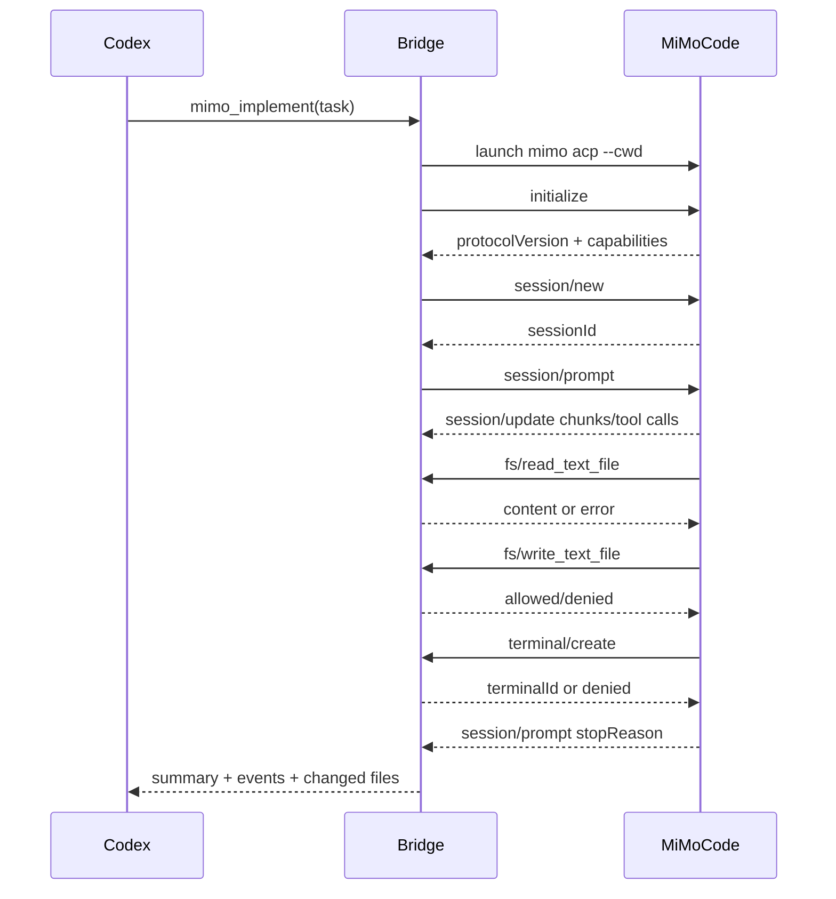

# Codex-MiMo ACP 集成实现计划

> **致智能体工作者：** 必须使用子技能：superpowers:subagent-driven-development（推荐）或 superpowers:executing-plans 来逐任务实施此计划。步骤使用复选框（`- [ ]`）语法进行跟踪。

**目标：** 构建一个实用的桥接层，使 Codex 能在软件开发过程中调用 MiMoCode，首先通过基于脚本的 MVP 实现，然后通过 Codex 插件驱动 MiMoCode 的 ACP 通信。

**架构：** Codex 作为编排者和审查者。MiMoCode 被视为专业编码代理。MVP 通过 `mimo run --format json` 进行快速验证；生产路径实现 ACP 客户端桥接，启动 `mimo acp`，管理会话，处理文件/终端请求，强制执行策略，并向 Codex 暴露高级工具。

**技术栈：** Node.js/TypeScript、MiMoCode CLI、ACP JSON-RPC over stdio、Codex 插件 MCP 服务器、JSONL 日志、本地策略配置、基于 Git 的 diff 验证。

---

## 1. 背景与范围

MiMoCode 目前提供两个有用的集成接口：

- `mimo run [message ..]`：非交互式执行，支持 `--format json`、`--agent`、`--model`、`--session`、`--continue`、`--fork`、`--file`、`--attach` 和 `--dangerously-skip-permissions`。
- `mimo acp`：ACP 代理入口，支持 `--cwd`、`--port` 和 `--hostname`。

ACP 是客户端与代理之间的 JSON-RPC 协议。客户端初始化代理、创建或恢复会话、发送提示、接收流式更新，并响应代理请求（如权限检查、文件读写和终端执行）。

本项目应产出：

1. 一个名为 `codex-mimo` 的脚本 MVP，供 Codex 在开发过程中调用。
2. 一个可复用的 ACP 桥接库。
3. 一个 Codex 插件，将 MiMoCode 暴露为 `mimo_plan`、`mimo_implement` 和 `mimo_review` 等工具。
4. 一个安全模型，默认阻止 MiMoCode 写入项目外或运行危险命令。

首版非目标：

- 不实现完整 UI。
- 不替换 Codex 的规划和验证循环。
- 不启用无条件 shell 执行。
- 不要求修改 MiMoCode 源码。

---

## 2. 推荐仓库结构

在 `E:\ideaProjects\codex-mimo` 下创建项目。

```text
codex-mimo/
  README.md
  package.json
  tsconfig.json
  vitest.config.ts
  .gitignore
  doc/
    codex-mimo-acp-integration-plan.md
    policy-guide.md
    acp-message-flow.md
  src/
    cli/
      main.ts
      commands.ts
      output.ts
    core/
      config.ts
      errors.ts
      logger.ts
      paths.ts
      policy.ts
      prompt.ts
      sessions.ts
    mimo/
      run-json.ts
      acp-client.ts
      acp-process.ts
      acp-types.ts
      acp-updates.ts
    codex/
      mcp-server.ts
      tools.ts
      tool-schemas.ts
    git/
      diff.ts
      status.ts
    test/
      fixtures/
        acp/
        mimo-run/
      unit/
        policy.test.ts
        paths.test.ts
        run-json.test.ts
        acp-client.test.ts
      integration/
        codex-mimo-cli.test.ts
```

### 文件职责

- `src/cli/main.ts`：`codex-mimo` 的 CLI 入口。
- `src/cli/commands.ts`：将 CLI 子命令映射到核心工作流。
- `src/cli/output.ts`：打印人类可读或 JSON 输出。
- `src/core/config.ts`：从 `codex-mimo.config.json` 加载项目配置。
- `src/core/policy.ts`：评估文件和终端权限。
- `src/core/paths.ts`：规范化和验证绝对路径。
- `src/core/prompt.ts`：为 plan、implement、review 和 fix-ci 工作流构建提示。
- `src/core/sessions.ts`：存储 MiMoCode 会话 ID 和元数据。
- `src/mimo/run-json.ts`：封装 `mimo run --format json`。
- `src/mimo/acp-client.ts`：JSON-RPC ACP 客户端。
- `src/mimo/acp-process.ts`：启动和管理 `mimo acp` 进程。
- `src/mimo/acp-types.ts`：本桥接使用的 ACP 方法的本地 TypeScript 类型。
- `src/mimo/acp-updates.ts`：将 ACP 更新转换为 Codex 友好的事件。
- `src/codex/mcp-server.ts`：Codex 插件暴露的 MCP 服务器。
- `src/codex/tools.ts`：`mimo_plan` 和 `mimo_implement` 等高级工具。
- `src/codex/tool-schemas.ts`：面向 Codex 的工具输入 schema。
- `src/git/diff.ts`：捕获前后 diff。
- `src/git/status.ts`：捕获脏工作区状态。

---

## 3. 产品设计

Codex 不应盲目移交整个任务。预期的协作模型是：

1. Codex 接收用户的开发请求。
2. Codex 判断 MiMoCode 是否有用。
3. Codex 调用 MiMoCode 进行专业的代码库工作。
4. MiMoCode 提议或应用变更。
5. Codex 验证、审查并报告结果。

### 角色

| 角色 | 职责 |
| --- | --- |
| 用户 | 定义产品意图并批准高风险操作 |
| Codex | 编排任务，验证输出，运行最终验证 |
| Codex-MiMo 桥接 | 将 Codex 工具调用转换为 MiMoCode CLI/ACP 交互 |
| MiMoCode | 探索仓库，规划代码变更，编辑文件，运行精确检查 |
| 策略层 | 控制路径、命令、权限和会话范围 |

### 工作流

| 工作流 | 首版实现 | 生产实现 |
| --- | --- | --- |
| 规划 | `mimo run --agent plan --format json` | ACP `session/prompt` 使用 plan 模式 |
| 实现 | `mimo run --agent build --format json` | ACP 会话，带 fs/terminal 策略执行 |
| 审查 | `mimo run --agent plan --format json` 配合 git diff 提示 | ACP 提示，嵌入 diff/资源 |
| 修复 CI | `mimo run --file ci.log --format json` | ACP 提示，附带 CI 日志资源 |
| 恢复 | `mimo run --session <id>` | ACP `session/load` 或 `session/resume`（支持时） |

---

## 4. 安全模型

桥接层必须默认保守。有两层保护：

1. MiMoCode 权限配置。
2. 桥接侧策略执行。

桥接侧策略是强制的，因为 ACP 允许代理请求客户端文件系统和终端操作。

### 默认策略

```jsonc
{
  "workspaceRoot": "E:/ideaProjects/codex-mimo",
  "fileAccess": {
    "read": ["${workspaceRoot}/**"],
    "write": ["${workspaceRoot}/**"],
    "deny": [
      "**/.env",
      "**/.env.*",
      "**/id_rsa",
      "**/id_ed25519",
      "**/.npmrc",
      "**/.pypirc"
    ]
  },
  "terminal": {
    "allow": [
      "git status*",
      "git diff*",
      "git log*",
      "npm test*",
      "npm run test*",
      "npm run lint*",
      "npm run typecheck*",
      "pnpm test*",
      "pnpm lint*",
      "pnpm typecheck*"
    ],
    "ask": [
      "npm install*",
      "pnpm install*",
      "npm run build*",
      "pnpm build*"
    ],
    "deny": [
      "rm *",
      "del *",
      "Remove-Item *",
      "git push*",
      "git reset*",
      "git checkout --*",
      "curl *",
      "wget *",
      "ssh *",
      "scp *"
    ]
  },
  "network": {
    "default": "deny"
  }
}
```

### 权限决策

| 请求 | 默认结果 |
| --- | --- |
| 读取工作区内文件 | 允许 |
| 读取 `.env` 或类似密钥的文件 | 拒绝 |
| 写入工作区内文件 | 交互模式下询问，CI 模式下拒绝（除非显式启用） |
| 写入工作区外 | 拒绝 |
| 运行测试/lint/类型检查 | 允许 |
| 安装包 | 询问 |
| 推送/重置/删除 | 拒绝 |
| 网络请求 | 拒绝，除非工作流明确启用 |

### 必需审计事件

每次调用都应写入 JSONL 审计日志：

```json
{"type":"session_start","workflow":"implement","cwd":"E:/project/app","agent":"build"}
{"type":"permission","operation":"terminal","command":"npm test","outcome":"allow"}
{"type":"file_write","path":"E:/project/app/src/login.ts","bytes":940}
{"type":"session_end","stopReason":"end_turn","changedFiles":["src/login.ts"]}
```

---

## 5. CLI MVP 规范

MVP CLI 应在 ACP 完全实现之前就能使用。

### 命令

```bash
codex-mimo healthcheck
codex-mimo plan "添加登录速率限制"
codex-mimo implement "修复失败的用户会话测试"
codex-mimo review --since HEAD
codex-mimo fix-ci --file ./ci.log
codex-mimo resume --session <mimo-session-id> "继续之前的任务"
```

### CLI 选项

```text
--cwd <path>              项目根目录。默认为进程 cwd。
--agent <name>            MiMoCode 代理。按工作流默认。
--model <provider/model>  可选的模型覆盖。
--json                    输出机器可读的 JSON。
--dry-run                 构建并打印 MiMoCode 命令但不执行。
--session <id>            继续 MiMoCode 会话。
--fork                    继续时 fork 会话。
--allow-write             允许 MiMoCode 写入文件。
--allow-install           允许包安装命令。
--log-dir <path>          JSONL 日志目录。
```

### 命令映射

`plan` 应调用：

```bash
mimo run --format json --agent plan --title "codex-mimo plan" "<prompt>"
```

`implement` 应调用：

```bash
mimo run --format json --agent build --title "codex-mimo implement" "<prompt>"
```

`review` 应调用：

```bash
git diff --stat HEAD
git diff HEAD
mimo run --format json --agent plan --title "codex-mimo review" "<prompt with diff summary>"
```

`fix-ci` 应调用：

```bash
mimo run --format json --agent build --file ./ci.log --title "codex-mimo fix-ci" "<prompt>"
```

### 提示模板：Plan

```text
You are being invoked by Codex as a specialist MiMoCode planning agent.

Task:
{user_task}

Rules:
- Do not edit files.
- Inspect only the code needed for this task.
- Produce a concise implementation plan with touched files, risks, and verification commands.
- Prefer the smallest change that satisfies the request.
- If the task is ambiguous, state assumptions instead of broadening scope.
```

### 提示模板：Implement

```text
You are being invoked by Codex as a specialist MiMoCode implementation agent.

Task:
{user_task}

Rules:
- Keep changes surgical.
- Do not modify unrelated files.
- Do not commit, push, reset, or delete files.
- Run the narrowest meaningful verification when practical.
- Return changed files, commands run, results, and remaining risks.
```

### 提示模板：Review

```text
You are being invoked by Codex as a specialist MiMoCode review agent.

Review the current diff:
{diff_summary}

Rules:
- Do not edit files.
- Prioritize correctness bugs, regressions, security, and missing tests.
- Give file and line references when available.
- If no issues are found, say that clearly and mention residual risk.
```

---

## 6. ACP 桥接规范

ACP 桥接是生产集成层。它应将 MiMoCode 作为子进程运行：

```bash
mimo acp --cwd <absolute-project-root>
```

### 最小 ACP 生命周期



### 初始化请求

```json
{
  "jsonrpc": "2.0",
  "id": 1,
  "method": "initialize",
  "params": {
    "protocolVersion": 1,
    "clientCapabilities": {
      "fs": {
        "readTextFile": true,
        "writeTextFile": true
      },
      "terminal": true
    },
    "clientInfo": {
      "name": "codex-mimo",
      "title": "Codex MiMoCode Bridge",
      "version": "0.1.0"
    }
  }
}
```

### 新建会话请求

```json
{
  "jsonrpc": "2.0",
  "id": 2,
  "method": "session/new",
  "params": {
    "cwd": "E:/ideaProjects/example-app",
    "mcpServers": []
  }
}
```

### 提示请求

```json
{
  "jsonrpc": "2.0",
  "id": 3,
  "method": "session/prompt",
  "params": {
    "sessionId": "sess_abc123",
    "prompt": [
      {
        "type": "text",
        "text": "修复失败的用户会话测试。保持变更精确。"
      }
    ]
  }
}
```

### 客户端请求处理器

桥接层必须处理以下代理到客户端的请求：

| ACP 方法 | 桥接行为 |
| --- | --- |
| `session/request_permission` | 评估策略，自动允许安全操作，拒绝危险操作，交互模式下可选询问用户 |
| `fs/read_text_file` | 规范化路径，验证是否允许，返回内容 |
| `fs/write_text_file` | 规范化路径，验证写入权限，写入内容，记录审计事件 |
| `terminal/create` | 规范化工作目录，验证命令，启动进程，返回终端 ID |
| `terminal/output` | 返回捕获的 stdout/stderr 和退出状态 |
| `terminal/wait_for_exit` | 等待进程完成（带超时） |
| `terminal/kill` | 停止进程 |
| `terminal/release` | 如果仍在运行则停止，释放资源 |

### 事件转换

ACP `session/update` 事件应转换为 Codex-MiMo 事件：

```ts
type CodexMimoEvent =
  | { type: "message"; role: "agent" | "user"; text: string; messageId?: string }
  | { type: "plan"; entries: Array<{ content: string; status: string; priority?: string }> }
  | { type: "tool"; id: string; title: string; kind: string; status: string }
  | { type: "diff"; path: string; oldText?: string | null; newText: string }
  | { type: "terminal"; id: string; output: string; exitCode?: number | null }
  | { type: "usage"; used: number; size: number; cost?: { amount: number; currency: string } };
```

---

## 7. Codex 插件规范

插件应向 Codex 暴露本地 MCP 服务器。

### 插件结构

```text
codex-mimocode-plugin/
  .codex-plugin/
    plugin.json
  .mcp.json
  package.json
  src/
    server.ts
    tools/
      healthcheck.ts
      plan.ts
      implement.ts
      review.ts
      fix-ci.ts
      resume.ts
    bridge/
      index.ts
```

### MCP 工具接口

#### `mimo_healthcheck`

输入：

```json
{
  "cwd": "E:/ideaProjects/example-app"
}
```

输出：

```json
{
  "ok": true,
  "mimoPath": "C:/Users/Administrator/AppData/Roaming/npm/mimo.cmd",
  "version": "x.y.z",
  "authConfigured": true,
  "supportsAcp": true
}
```

#### `mimo_plan`

输入：

```json
{
  "cwd": "E:/ideaProjects/example-app",
  "task": "添加登录速率限制",
  "agent": "plan",
  "model": "mimo/mimo-v2.5-pro"
}
```

输出：

```json
{
  "summary": "Plan created.",
  "events": [],
  "sessionId": "sess_abc123",
  "changedFiles": [],
  "verification": []
}
```

#### `mimo_implement`

输入：

```json
{
  "cwd": "E:/ideaProjects/example-app",
  "task": "修复失败的用户会话测试",
  "allowWrite": true,
  "allowInstall": false
}
```

输出：

```json
{
  "summary": "Implementation completed.",
  "sessionId": "sess_abc123",
  "changedFiles": ["src/session.ts", "test/session.test.ts"],
  "commands": [
    {
      "command": "npm test -- session.test.ts",
      "exitCode": 0
    }
  ],
  "risks": []
}
```

#### `mimo_review`

输入：

```json
{
  "cwd": "E:/ideaProjects/example-app",
  "base": "HEAD"
}
```

输出：

```json
{
  "findings": [
    {
      "severity": "medium",
      "file": "src/session.ts",
      "line": 42,
      "message": "Token expiry check does not cover clock skew."
    }
  ],
  "summary": "发现一个中等问题。"
}
```

---

## 8. 实现任务

### 任务 1：初始化 TypeScript 项目

**涉及文件：**

- 创建：`package.json`
- 创建：`tsconfig.json`
- 创建：`vitest.config.ts`
- 创建：`.gitignore`

- [ ] **步骤 1：创建 `package.json`**

```json
{
  "name": "codex-mimo",
  "version": "0.1.0",
  "private": true,
  "type": "module",
  "bin": {
    "codex-mimo": "./dist/cli/main.js"
  },
  "scripts": {
    "build": "tsc -p tsconfig.json",
    "test": "vitest run",
    "test:watch": "vitest",
    "lint": "tsc -p tsconfig.json --noEmit"
  },
  "dependencies": {
    "execa": "^9.5.2",
    "minimatch": "^10.0.1",
    "zod": "^3.24.1"
  },
  "devDependencies": {
    "@types/node": "^22.10.2",
    "typescript": "^5.7.2",
    "vitest": "^2.1.8"
  }
}
```

- [ ] **步骤 2：创建 `tsconfig.json`**

```json
{
  "compilerOptions": {
    "target": "ES2022",
    "module": "NodeNext",
    "moduleResolution": "NodeNext",
    "strict": true,
    "declaration": true,
    "outDir": "dist",
    "rootDir": "src",
    "esModuleInterop": true,
    "forceConsistentCasingInFileNames": true,
    "skipLibCheck": true
  },
  "include": ["src/**/*.ts"]
}
```

- [ ] **步骤 3：创建 `vitest.config.ts`**

```ts
import { defineConfig } from "vitest/config";

export default defineConfig({
  test: {
    include: ["test/**/*.test.ts"],
    environment: "node"
  }
});
```

- [ ] **步骤 4：创建 `.gitignore`**

```text
node_modules/
dist/
.codex-mimo/
*.log
```

- [ ] **步骤 5：验证项目骨架**

运行：

```bash
npm install
npm run build
```

预期：

```text
后续任务添加源文件后无 TypeScript 错误。
```

### 任务 2：实现路径策略

**涉及文件：**

- 创建：`src/core/paths.ts`
- 创建：`src/core/policy.ts`
- 测试：`test/unit/policy.test.ts`

- [ ] **步骤 1：创建路径辅助函数**

```ts
// src/core/paths.ts
import path from "node:path";

export function normalizePath(input: string): string {
  return path.resolve(input).replace(/\\/g, "/");
}

export function isPathInside(parent: string, child: string): boolean {
  const normalizedParent = normalizePath(parent);
  const normalizedChild = normalizePath(child);
  return (
    normalizedChild === normalizedParent ||
    normalizedChild.startsWith(`${normalizedParent}/`)
  );
}
```

- [ ] **步骤 2：创建策略评估器**

```ts
// src/core/policy.ts
import { minimatch } from "minimatch";
import { isPathInside, normalizePath } from "./paths.js";

export type Decision = "allow" | "ask" | "deny";

export interface BridgePolicy {
  workspaceRoot: string;
  deniedFileGlobs: string[];
  allowedCommands: string[];
  askCommands: string[];
  deniedCommands: string[];
}

export const defaultPolicy = (workspaceRoot: string): BridgePolicy => ({
  workspaceRoot: normalizePath(workspaceRoot),
  deniedFileGlobs: [
    "**/.env",
    "**/.env.*",
    "**/id_rsa",
    "**/id_ed25519",
    "**/.npmrc",
    "**/.pypirc"
  ],
  allowedCommands: [
    "git status*",
    "git diff*",
    "git log*",
    "npm test*",
    "npm run test*",
    "npm run lint*",
    "npm run typecheck*",
    "pnpm test*",
    "pnpm lint*",
    "pnpm typecheck*"
  ],
  askCommands: ["npm install*", "pnpm install*", "npm run build*", "pnpm build*"],
  deniedCommands: [
    "rm *",
    "del *",
    "Remove-Item *",
    "git push*",
    "git reset*",
    "git checkout --*",
    "curl *",
    "wget *",
    "ssh *",
    "scp *"
  ]
});

export function decideFileRead(policy: BridgePolicy, filePath: string): Decision {
  const normalized = normalizePath(filePath);
  if (!isPathInside(policy.workspaceRoot, normalized)) return "deny";
  if (policy.deniedFileGlobs.some((glob) => minimatch(normalized, glob))) return "deny";
  return "allow";
}

export function decideFileWrite(policy: BridgePolicy, filePath: string): Decision {
  const normalized = normalizePath(filePath);
  if (!isPathInside(policy.workspaceRoot, normalized)) return "deny";
  if (policy.deniedFileGlobs.some((glob) => minimatch(normalized, glob))) return "deny";
  return "ask";
}

export function decideCommand(policy: BridgePolicy, commandLine: string): Decision {
  if (policy.deniedCommands.some((glob) => minimatch(commandLine, glob))) return "deny";
  if (policy.allowedCommands.some((glob) => minimatch(commandLine, glob))) return "allow";
  if (policy.askCommands.some((glob) => minimatch(commandLine, glob))) return "ask";
  return "ask";
}
```

- [ ] **步骤 3：添加策略测试**

```ts
// test/unit/policy.test.ts
import { describe, expect, it } from "vitest";
import {
  decideCommand,
  decideFileRead,
  decideFileWrite,
  defaultPolicy
} from "../../src/core/policy.js";

describe("policy", () => {
  const policy = defaultPolicy("E:/project/app");

  it("允许工作区内的正常读取", () => {
    expect(decideFileRead(policy, "E:/project/app/src/index.ts")).toBe("allow");
  });

  it("拒绝读取密钥文件", () => {
    expect(decideFileRead(policy, "E:/project/app/.env")).toBe("deny");
  });

  it("拒绝工作区外的写入", () => {
    expect(decideFileWrite(policy, "E:/other/app/src/index.ts")).toBe("deny");
  });

  it("正常写入前询问", () => {
    expect(decideFileWrite(policy, "E:/project/app/src/index.ts")).toBe("ask");
  });

  it("允许安全的验证命令", () => {
    expect(decideCommand(policy, "npm test -- session.test.ts")).toBe("allow");
  });

  it("拒绝危险的 git 命令", () => {
    expect(decideCommand(policy, "git push origin main")).toBe("deny");
  });
});
```

- [ ] **步骤 4：运行测试**

运行：

```bash
npm test -- policy.test.ts
```

预期：

```text
6 个测试通过。
```

### 任务 3：实现 `mimo run --format json` 封装

**涉及文件：**

- 创建：`src/mimo/run-json.ts`
- 测试：`test/unit/run-json.test.ts`

- [ ] **步骤 1：定义封装类型和命令构建器**

```ts
// src/mimo/run-json.ts
export interface MimoRunOptions {
  cwd: string;
  message: string;
  agent?: string;
  model?: string;
  session?: string;
  fork?: boolean;
  files?: string[];
}

export function buildMimoRunArgs(options: MimoRunOptions): string[] {
  const args = ["run", "--format", "json"];
  if (options.agent) args.push("--agent", options.agent);
  if (options.model) args.push("--model", options.model);
  if (options.session) args.push("--session", options.session);
  if (options.fork) args.push("--fork");
  for (const file of options.files ?? []) args.push("--file", file);
  args.push(options.message);
  return args;
}
```

- [ ] **步骤 2：添加命令构建器测试**

```ts
// test/unit/run-json.test.ts
import { describe, expect, it } from "vitest";
import { buildMimoRunArgs } from "../../src/mimo/run-json.js";

describe("buildMimoRunArgs", () => {
  it("构建基本的 plan 命令", () => {
    expect(
      buildMimoRunArgs({
        cwd: "E:/project/app",
        message: "Plan the login change",
        agent: "plan"
      })
    ).toEqual(["run", "--format", "json", "--agent", "plan", "Plan the login change"]);
  });

  it("包含 session、fork、model 和 files", () => {
    expect(
      buildMimoRunArgs({
        cwd: "E:/project/app",
        message: "Fix CI",
        agent: "build",
        model: "mimo/mimo-v2.5-pro",
        session: "sess_123",
        fork: true,
        files: ["ci.log"]
      })
    ).toEqual([
      "run",
      "--format",
      "json",
      "--agent",
      "build",
      "--model",
      "mimo/mimo-v2.5-pro",
      "--session",
      "sess_123",
      "--fork",
      "--file",
      "ci.log",
      "Fix CI"
    ]);
  });
});
```

- [ ] **步骤 3：运行测试**

运行：

```bash
npm test -- run-json.test.ts
```

预期：

```text
2 个测试通过。
```

### 任务 4：实现 CLI 命令

**涉及文件：**

- 创建：`src/cli/main.ts`
- 创建：`src/cli/commands.ts`
- 创建：`src/core/prompt.ts`

- [ ] **步骤 1：创建提示构建器**

```ts
// src/core/prompt.ts
export function planPrompt(task: string): string {
  return [
    "You are being invoked by Codex as a specialist MiMoCode planning agent.",
    "",
    "Task:",
    task,
    "",
    "Rules:",
    "- Do not edit files.",
    "- Inspect only the code needed for this task.",
    "- Produce a concise implementation plan with touched files, risks, and verification commands.",
    "- Prefer the smallest change that satisfies the request.",
    "- If the task is ambiguous, state assumptions instead of broadening scope."
  ].join("\n");
}

export function implementPrompt(task: string): string {
  return [
    "You are being invoked by Codex as a specialist MiMoCode implementation agent.",
    "",
    "Task:",
    task,
    "",
    "Rules:",
    "- Keep changes surgical.",
    "- Do not modify unrelated files.",
    "- Do not commit, push, reset, or delete files.",
    "- Run the narrowest meaningful verification when practical.",
    "- Return changed files, commands run, results, and remaining risks."
  ].join("\n");
}
```

- [ ] **步骤 2：创建命令分发器**

```ts
// src/cli/commands.ts
import { execa } from "execa";
import { buildMimoRunArgs } from "../mimo/run-json.js";
import { implementPrompt, planPrompt } from "../core/prompt.js";

export async function runPlan(cwd: string, task: string): Promise<void> {
  const args = buildMimoRunArgs({
    cwd,
    agent: "plan",
    message: planPrompt(task)
  });
  const subprocess = execa("mimo", args, { cwd, stdout: "inherit", stderr: "inherit" });
  await subprocess;
}

export async function runImplement(cwd: string, task: string): Promise<void> {
  const args = buildMimoRunArgs({
    cwd,
    agent: "build",
    message: implementPrompt(task)
  });
  const subprocess = execa("mimo", args, { cwd, stdout: "inherit", stderr: "inherit" });
  await subprocess;
}
```

- [ ] **步骤 3：创建 CLI 入口**

```ts
// src/cli/main.ts
#!/usr/bin/env node
import { runImplement, runPlan } from "./commands.js";

const [, , command, ...rest] = process.argv;
const cwd = process.cwd();
const task = rest.join(" ").trim();

if (!command || !task) {
  console.error("Usage: codex-mimo <plan|implement> <task>");
  process.exit(2);
}

if (command === "plan") {
  await runPlan(cwd, task);
} else if (command === "implement") {
  await runImplement(cwd, task);
} else {
  console.error(`Unknown command: ${command}`);
  process.exit(2);
}
```

- [ ] **步骤 4：构建 CLI**

运行：

```bash
npm run build
```

预期：

```text
生成 dist/cli/main.js。
```

### 任务 5：实现 ACP 客户端骨架

**涉及文件：**

- 创建：`src/mimo/acp-types.ts`
- 创建：`src/mimo/acp-client.ts`
- 测试：`test/unit/acp-client.test.ts`

- [ ] **步骤 1：定义最小 ACP 类型**

```ts
// src/mimo/acp-types.ts
export interface JsonRpcRequest {
  jsonrpc: "2.0";
  id: number;
  method: string;
  params?: unknown;
}

export interface JsonRpcResponse {
  jsonrpc: "2.0";
  id: number;
  result?: unknown;
  error?: {
    code: number;
    message: string;
    data?: unknown;
  };
}

export interface JsonRpcNotification {
  jsonrpc: "2.0";
  method: string;
  params?: unknown;
}

export type JsonRpcMessage = JsonRpcRequest | JsonRpcResponse | JsonRpcNotification;
```

- [ ] **步骤 2：实现行帧解析器**

```ts
// src/mimo/acp-client.ts
import type { JsonRpcMessage } from "./acp-types.js";

export class JsonRpcLineParser {
  private buffer = "";

  push(chunk: string): JsonRpcMessage[] {
    this.buffer += chunk;
    const messages: JsonRpcMessage[] = [];
    while (true) {
      const newline = this.buffer.indexOf("\n");
      if (newline === -1) break;
      const line = this.buffer.slice(0, newline).trim();
      this.buffer = this.buffer.slice(newline + 1);
      if (!line) continue;
      messages.push(JSON.parse(line) as JsonRpcMessage);
    }
    return messages;
  }
}

export function encodeMessage(message: JsonRpcMessage): string {
  return `${JSON.stringify(message)}\n`;
}
```

- [ ] **步骤 3：测试行解析器**

```ts
// test/unit/acp-client.test.ts
import { describe, expect, it } from "vitest";
import { encodeMessage, JsonRpcLineParser } from "../../src/mimo/acp-client.js";

describe("JsonRpcLineParser", () => {
  it("解析换行分隔的 JSON-RPC 消息", () => {
    const parser = new JsonRpcLineParser();
    const messages = parser.push(
      '{"jsonrpc":"2.0","id":1,"result":{}}\n{"jsonrpc":"2.0","method":"session/update","params":{}}\n'
    );
    expect(messages).toHaveLength(2);
  });

  it("缓冲部分消息", () => {
    const parser = new JsonRpcLineParser();
    expect(parser.push('{"jsonrpc":"2.0"')).toEqual([]);
    expect(parser.push(',"id":1,"result":{}}\n')).toHaveLength(1);
  });

  it("使用换行分隔符编码消息", () => {
    expect(encodeMessage({ jsonrpc: "2.0", id: 1, method: "initialize" })).toBe(
      '{"jsonrpc":"2.0","id":1,"method":"initialize"}\n'
    );
  });
});
```

- [ ] **步骤 4：运行测试**

运行：

```bash
npm test -- acp-client.test.ts
```

预期：

```text
3 个测试通过。
```

### 任务 6：实现 ACP 进程管理器

**涉及文件：**

- 创建：`src/mimo/acp-process.ts`

- [ ] **步骤 1：创建进程启动器**

```ts
// src/mimo/acp-process.ts
import { execa, type ExecaChildProcess } from "execa";

export interface AcpProcess {
  process: ExecaChildProcess;
  write(message: string): void;
  stop(): void;
}

export function startMimoAcp(cwd: string): AcpProcess {
  const child = execa("mimo", ["acp", "--cwd", cwd], {
    cwd,
    stdin: "pipe",
    stdout: "pipe",
    stderr: "pipe"
  });

  return {
    process: child,
    write(message: string) {
      child.stdin?.write(message);
    },
    stop() {
      child.kill("SIGTERM");
    }
  };
}
```

- [ ] **步骤 2：添加手动冒烟测试命令**

运行：

```bash
node -e "console.log('Use npm run build, then invoke startMimoAcp from a local script when mimo is installed')"
```

预期：

```text
代码编译通过。真实 ACP 冒烟测试需要安装并认证 MiMoCode。
```

### 任务 7：实现 Codex MCP 工具接口

**涉及文件：**

- 创建：`src/codex/tool-schemas.ts`
- 创建：`src/codex/tools.ts`
- 创建：`src/codex/mcp-server.ts`

- [ ] **步骤 1：定义工具 schema**

```ts
// src/codex/tool-schemas.ts
import { z } from "zod";

export const PlanInput = z.object({
  cwd: z.string(),
  task: z.string(),
  agent: z.string().default("plan"),
  model: z.string().optional()
});

export const ImplementInput = z.object({
  cwd: z.string(),
  task: z.string(),
  allowWrite: z.boolean().default(false),
  allowInstall: z.boolean().default(false)
});
```

- [ ] **步骤 2：使用 MVP 封装实现工具函数**

```ts
// src/codex/tools.ts
import { runImplement, runPlan } from "../cli/commands.js";
import { ImplementInput, PlanInput } from "./tool-schemas.js";

export async function mimoPlan(input: unknown) {
  const parsed = PlanInput.parse(input);
  await runPlan(parsed.cwd, parsed.task);
  return {
    summary: "MiMoCode plan completed.",
    changedFiles: [],
    verification: []
  };
}

export async function mimoImplement(input: unknown) {
  const parsed = ImplementInput.parse(input);
  if (!parsed.allowWrite) {
    throw new Error("mimo_implement requires allowWrite=true.");
  }
  await runImplement(parsed.cwd, parsed.task);
  return {
    summary: "MiMoCode implementation completed. Codex should inspect git diff and run verification.",
    changedFiles: [],
    verification: []
  };
}
```

- [ ] **步骤 3：选择 MCP SDK 后实现 MCP 服务器**

使用项目选定的官方 MCP TypeScript SDK。注册：

```text
mimo_healthcheck
mimo_plan
mimo_implement
mimo_review
mimo_fix_ci
mimo_resume
```

预期行为：

```text
Codex 可以发现工具并从插件中调用 mimo_plan/mimo_implement。
```

### 任务 8：添加 MiMoCode 项目配置模板

**涉及文件：**

- 创建：`templates/mimocode.jsonc`
- 创建：`templates/agents/review.md`
- 创建：`templates/commands/codex-review.md`

- [ ] **步骤 1：创建 `templates/mimocode.jsonc`**

```jsonc
{
  "$schema": "https://mimo.xiaomi.com//config.json",
  "model": "mimo/mimo-v2.5-pro",
  "small_model": "mimo/mimo-v2.5-pro",
  "default_agent": "build",
  "share": "manual",
  "permission": {
    "*": "ask",
    "read": {
      "*": "allow",
      "*.env": "deny",
      "*.env.*": "deny",
      "*.env.example": "allow"
    },
    "edit": "ask",
    "bash": {
      "*": "ask",
      "git status*": "allow",
      "git diff*": "allow",
      "git log*": "allow",
      "npm test*": "allow",
      "npm run test*": "allow",
      "npm run lint*": "allow",
      "git push*": "deny",
      "git reset*": "deny",
      "rm *": "deny"
    },
    "external_directory": "deny"
  },
  "agent": {
    "codex-reviewer": {
      "description": "Reviews code for correctness, security, maintainability, and missing tests.",
      "mode": "subagent",
      "model": "mimo/mimo-v2.5-pro",
      "tools": {
        "write": false,
        "edit": false
      },
      "permission": {
        "bash": {
          "*": "ask",
          "git diff*": "allow",
          "git status*": "allow"
        }
      }
    }
  }
}
```

- [ ] **步骤 2：创建审查代理模板**

```markdown
---
description: Reviews code without editing files
mode: subagent
model: mimo/mimo-v2.5-pro
tools:
  write: false
  edit: false
permission:
  bash:
    "*": ask
    "git diff*": allow
    "git status*": allow
---

You are a code review specialist invoked by Codex.

Focus on:
- Correctness bugs
- Behavioral regressions
- Security issues
- Missing or weak tests
- Risky changes outside the requested scope

Do not edit files. Report findings with file and line references when possible.
```

- [ ] **步骤 3：创建审查命令模板**

```markdown
---
description: Review the current Codex-managed diff
agent: codex-reviewer
---

Review the current diff created during a Codex-managed task.

Recent status:
! `git status --short`

Current diff:
! `git diff`

Return findings ordered by severity. Do not edit files.
```

### 任务 9：验证与发布清单

**涉及文件：**

- 修改：`README.md`
- 创建：`doc/policy-guide.md`
- 创建：`doc/acp-message-flow.md`

- [ ] **步骤 1：文档设置**

添加到 `README.md`：

```markdown
# Codex MiMoCode Bridge

## Setup

```bash
npm install
npm run build
node dist/cli/main.js plan "Explain the project structure"
```

MiMoCode must be installed and authenticated before using this bridge:

```bash
mimo --version
mimo auth list
```

## MVP Usage

```bash
codex-mimo plan "Add login rate limiting"
codex-mimo implement "Fix failing user-session test"
```

## Safety

The bridge denies writes outside the workspace and denies secret-like file reads by default.
```
```

- [ ] **步骤 2：运行完整验证**

运行：

```bash
npm run build
npm test
```

预期：

```text
TypeScript 构建通过。
所有单元测试通过。
```

- [ ] **步骤 3：手动 MiMoCode 冒烟测试**

在一次性测试仓库中运行：

```bash
codex-mimo plan "Find the smallest useful test command for this project"
```

预期：

```text
MiMoCode 返回计划且不修改文件。
```

- [ ] **步骤 4：手动实现冒烟测试**

在一次性测试仓库中运行：

```bash
git status --short
codex-mimo implement "Add a README sentence saying this is a smoke test project"
git diff
```

预期：

```text
仅 README.md 变更。
未创建提交。
未触及仓库外的文件。
```

---

## 9. 上线计划

### 阶段 0：环境确认

- 确认 `mimo --version`。
- 确认 `mimo auth list`。
- 确认 `mimo run --format json "Say hello"` 可用。
- 确认 `mimo acp --cwd <project>` 启动后不会立即失败。

退出标准：

- MiMoCode CLI 在目标开发机器上可用。
- 认证已配置。
- 一条 JSON 模式命令执行成功。

### 阶段 1：脚本 MVP

- 实现 `codex-mimo plan`。
- 实现 `codex-mimo implement`。
- 实现 `codex-mimo review`。
- 捕获 stdout/stderr 日志。
- 捕获执行前后的 git diff。

退出标准：

- Codex 可手动调用脚本。
- 脚本可在不修改文件的情况下进行规划。
- 脚本可在一次性仓库中实现简单变更。
- 最终 diff 可被 Codex 检查。

### 阶段 2：ACP 桥接

- 实现 JSON-RPC 行传输。
- 实现 initialize/session/prompt。
- 实现会话更新流。
- 实现文件读写处理器。
- 实现终端处理器。
- 实现策略执行。

退出标准：

- 桥接可完成一次 ACP 提示轮次。
- 文件请求限制在工作区根目录内。
- 危险终端命令被拒绝。
- 使用量和工具事件被记录。

### 阶段 3：Codex 插件

- 将 MCP 服务器打包为 Codex 插件。
- 暴露 `mimo_healthcheck`、`mimo_plan`、`mimo_implement`、`mimo_review`、`mimo_fix_ci`。
- 添加描述何时及如何调用 MiMoCode 的 Codex 技能。
- 添加插件文档。

退出标准：

- Codex 发现插件工具。
- Codex 可调用 `mimo_plan`。
- Codex 可在一次性仓库中调用 `mimo_implement`。
- Codex 可审查和验证 MiMoCode 的变更。

### 阶段 4：团队加固

- 添加审计日志保留。
- 添加可配置的策略配置文件。
- 添加 CI 安全的非交互模式。
- 添加会话恢复/列表支持。
- 添加企业 MCP 服务器白名单。

退出标准：

- 团队可在选定仓库上启用桥接。
- 安全审查批准默认策略。
- 工程师有文档化的回滚和禁用步骤。

---

## 10. 风险登记

| 风险 | 影响 | 缓解措施 |
| --- | --- | --- |
| MiMoCode 修改无关文件 | 用户失去信任，可能产生回归 | 捕获前后 diff，强制工作区路径策略，要求 Codex 审查 |
| 危险 shell 命令 | 数据丢失或泄露 | 默认拒绝破坏性命令，安装/构建时询问，永不自动批准网络操作 |
| ACP 协议变更 | MiMoCode/ACP 更新后桥接中断 | 保持 ACP 类型本地化和版本化，添加协议版本检查 |
| `mimo run` JSON 输出变更 | MVP 解析器失效 | 仅将 `mimo run` 视为 MVP，保留原始日志，生产环境迁移至 ACP |
| 重复代理上下文 | 更高的 token 成本 | 使用简洁提示，优先 `plan` 再 `implement`，有意地恢复会话 |
| 隐藏的认证/配置问题 | 工具在工作中途失败 | 实现 `mimo_healthcheck` 并首先运行 |
| Codex 和 MiMoCode 之间职责不清 | 输出混乱和遗漏验证 | Codex 始终拥有最终验证和面向用户的摘要 |

---

## 11. 验收标准

当以下条件全部满足时，项目可投入使用：

- `codex-mimo healthcheck` 报告 MiMoCode 安装和认证状态。
- `codex-mimo plan` 可在不修改文件的情况下运行。
- `codex-mimo implement` 可修改一次性仓库并留下清晰的 git diff。
- 默认策略拒绝工作区外的写入。
- 默认策略拒绝类似密钥文件的读取。
- 默认策略拒绝 `git push`、`git reset` 和破坏性删除命令。
- ACP 桥接可完成 `initialize`、`session/new` 和 `session/prompt`。
- ACP 桥接可处理 `session/update` 消息块和工具调用。
- Codex 插件至少暴露 `mimo_plan`、`mimo_implement` 和 `mimo_review`。
- 文档说明安装、使用、安全模型、故障排查和回滚。

---

## 12. 推荐首个工程冲刺

首个冲刺仅实现：

1. TypeScript 骨架。
2. 策略评估器。
3. `mimo run --format json` 封装。
4. `codex-mimo plan`。
5. `codex-mimo implement`。
6. README 使用说明。

首个冲刺不实现完整的 ACP 桥接。构建 ACP 解析器骨架并保持测试覆盖，但首先通过 `mimo run` 验证产品工作流。

这使首个版本足够小以在真实开发中测试，同时保留正确的长期方向。
