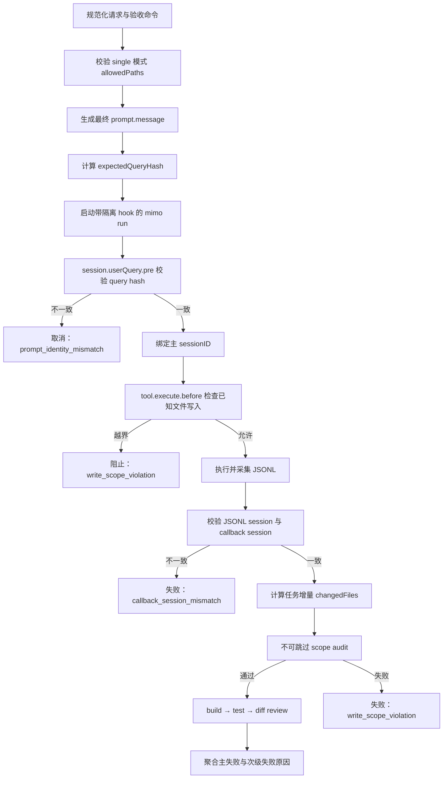

# MiMoCode 任务隔离与安全执行实施方案

## 1. 文档目的

本文针对 Codex 会话 `019fa341-ba56-7913-bc86-308d784c1205` 暴露出的任务串线、回调会话错配、写入范围失效、Windows Maven 命令不可用、复合失败信息丢失和变更文件归因不准确等问题，给出可直接编码、测试和验收的实施方案。

本文只定义 Codex-MiMo bridge 的修改，不修改故障发生时的 `shoping` 项目，也不假设能够直接修改 MiMoCode 上游内部调度实现。

## 2. 目标与非目标

### 2.1 目标

完成后，插件必须满足以下安全和诊断目标：

1. MiMoCode 实际接收的首个用户查询必须与 bridge 发出的查询一致，否则在第一次模型调用前停止。
2. JSONL 主会话、hook 主会话和 `session.post` 回调会话必须形成一一对应关系。
3. `batchMode=single` 的写任务必须拥有明确、非全仓库的 `allowedPaths`。
4. 已知文件写入工具必须在执行前进行路径范围检查。
5. 无论构建或测试是否失败，任务结束时都必须执行不可跳过的范围审计。
6. `changedFiles` 只表示任务运行期间实际产生的变化，不混入未被任务触碰的既有脏文件。
7. Maven 项目在 Windows 上优先使用仓库中的 `mvnw.cmd`，并在编辑前发现不可执行的验收命令。
8. 运行超时、范围违规、回调错误和验收失败可以同时出现在结构化结果中，不再被单一顶层状态掩盖。
9. 所有新增行为都有单元测试；任务身份、hook 形状和真实回调行为有本地 smoke 覆盖。

### 2.2 非目标

本次不实施以下内容：

- 不修改 MiMoCode 上游的 session scheduler、cron 或内部任务队列。
- 不依赖推测来认定错误任务的上游根因。
- 不自动回滚越界写入，因为工作区可能包含用户自己的未提交修改。
- 不通过解析任意 shell 字符串承诺阻止所有 shell 写入。
- 不重构 supervisor、notification outbox 或 Codex Desktop heartbeat。
- 不改变现有顶层 `JobStatus` 的含义。

## 3. 已确认的故障基线

### 3.1 任务与执行内容不一致

根作业和子作业保存的目标均为在 `common-security` 中实现 Java 冒泡排序，但子作业 JSONL 唯一会话 `ses_05cbd642...` 的首个工具动作是搜索 Spring Boot + Vue 电商网站，并继续创建商品、购物车和前端文件。

结论：bridge 不能只相信启动参数已经正确传递，必须在 MiMoCode 的首个 user query 入口再次校验任务身份。

### 3.2 回调会话与 JSONL 会话不一致

JSONL 只出现 `ses_05cbd642...`，作业接受的 `session.post` 回调却来自 `ses_05cbc139...`，且该回调在主进程继续输出事件时已经到达。

结论：`invocationId` 会被同一进程中的子会话继承，不能单独作为完成回调的关联键。

### 3.3 `allowedPaths` 没有构成保护

`batchMode=single` 自动生成：

```json
{
  "allowedPaths": ["**"]
}
```

但当前范围判断是精确路径或目录前缀判断，并不支持 glob；同时范围检查位于 build 和 test 之后，build 失败会导致 diff check 被跳过。

结论：必须统一路径语义、禁止默认全仓库范围，并把范围审计从普通 diff check 中拆出来。

### 3.4 Maven 失败与运行超时是两个独立故障

MiMoCode 子进程在 600 秒绝对超时后终止；后置验收命令 `mvn ...` 又在约 35ms 内因找不到全局 Maven 而失败。目标项目已有 `mvnw.cmd`。

结论：顶层状态可以继续是 `timeout`，但结果必须同时暴露验收命令不可用这一第二原因。

### 3.5 `changedFiles` 存在归因缺口

事件日志证明错误会话确实执行了无关文件写入，因此本次大量文件不能简单视为显示污染；但当前 `collectChangedFiles()` 会合并相对 `HEAD` 的全部差异，也确实可能包含任务开始前已有且未被任务触碰的文件。

结论：需要基于运行前后 fingerprint 和作业期间提交计算任务增量。

## 4. 总体设计

### 4.1 目标执行链



### 4.2 关键设计原则

1. **双重身份校验**：prompt hash 解决“执行了错误任务”，session 绑定解决“接受了错误回调”；二者缺一不可。
2. **运行会话为权威**：作业 `sessionId` 来自 JSONL 主会话，回调 session 只作为一致性证据。
3. **范围检查前置且不可跳过**：文件工具执行前阻止，结束时再由 Git 增量审计兜底。
4. **显式范围优先于自然语言推断**：`single` 模式不从任务描述猜测目录。
5. **保留顶层兼容性**：继续使用现有 status 和 errorCode；新增可选 causes 表达复合故障。
6. **不隐藏请求与执行差异**：验收报告同时记录 requested command 和 executed command。

## 5. 工作流 A：任务身份与会话关联

该工作流为最高优先级，必须先于其他写入功能发布。

### 5.1 修改 `src/mimo/hook-callback.ts`

#### 5.1.1 扩展 controller 输入

`createHookCallbackController()` 增加：

```ts
interface HookExecutionGuardInput {
  expectedQueryHash: string;
  allowedPaths?: string[];
}
```

不要传递完整 prompt。环境变量只包含：

```text
CODEX_MIMO_EXPECTED_QUERY_HASH
CODEX_MIMO_ALLOWED_PATHS_JSON
```

`allowedPaths` JSON 应设置合理长度上限，并继续避免记录到公开日志。

#### 5.1.2 生成的 hook 增加状态

运行时 hook 内部维护：

```ts
let primarySessionId: string | undefined;
let firstPrimaryQueryChecked = false;
let guardFailure:
  | { code: "prompt_identity_mismatch"; sessionId: string }
  | { code: "write_scope_violation"; sessionId: string; path: string }
  | undefined;
```

#### 5.1.3 增加 `session.pre`

规则：

- 第一次 `session.pre` 的 `sessionID` 绑定为 `primarySessionId`。
- 后续不同 session 被视为同一 invocation 下的子会话，不替换主会话。
- `session.pre` 本身不宣布成功完成。

#### 5.1.4 增加 `session.userQuery.pre`

只检查主会话的第一次 user query：

1. 对 `input.query` 计算 SHA-256。
2. 与 `CODEX_MIMO_EXPECTED_QUERY_HASH` 常量时间比较。
3. 不一致时：
   - `output.cancel = true`；
   - 设置稳定的 `cancelReason`；
   - 保存 `guardFailure=prompt_identity_mismatch`。

预期效果是错误任务在第一次 LLM step 之前停止，不产生任何业务工具调用。

#### 5.1.5 收紧 `session.post`

- 只有 `input.sessionID === primarySessionId` 时才向 callback server POST。
- payload 增加可选的 `guardFailure`。
- 不发送 `finalText`、trajectory 或原始 query。
- 子会话 `session.post` 静默忽略，不得抢占 controller promise。

#### 5.1.6 controller 支持预绑定和暂存

扩展 `HookCallbackController`：

```ts
bindRunSession(sessionId: string): void;
getRunSession(): string | undefined;
```

callback server 行为：

- invocation 不匹配：`409`。
- payload 无效：`400`。
- 尚未绑定运行 session：按 session 暂存有限数量的回调。
- 绑定后只接受相同 session。
- 已绑定后收到其他 session：记录安全诊断，不 resolve。
- 超时仍无匹配回调：返回带诊断的 missing evidence。

暂存数量建议最多 8 条，避免异常客户端占用内存。

### 5.2 修改 `src/core/job-worker.ts`

#### 5.2.1 计算任务摘要

`definition.buildPrompt()` 返回后，对最终 `prompt.message` 计算 SHA-256，并传给 hook controller。

必须对实际传给 `buildMimoArgs()` 的消息计算摘要，包括大文本/非 ASCII prompt transport 生成的文件指针消息。

#### 5.2.2 同步捕获主运行 session

在 `onLine` 中：

- 第一个有效 `sessionID` 同步保存为局部 `runSessionId`；
- 立即调用 `hook.bindRunSession(runSessionId)`；
- 后续 JSONL 出现不同 session 时记录 `event_session_mismatch`，不得覆盖；
- 持久化 observation 仍可异步进行，但最终结果不依赖异步写入是否及时完成。

#### 5.2.3 将 `runSessionId` 放入 finalize context

扩展 `JobExecutionFinalizeContext`：

```ts
runSessionId?: string;
```

finalize 不再从 callback 推断主 session。

### 5.3 修改 `src/core/job-outcome.ts`

`commonOutcomeFields()` 的 session 来源改为 `evidence.runSessionId`。

新增分类：

```text
prompt_identity_mismatch
callback_session_mismatch
event_session_mismatch
```

优先级建议：

1. 用户取消；
2. prompt identity guard；
3. event/callback session mismatch；
4. progress/idle/process timeout；
5. callback missing/error/cancelled；
6. verification；
7. MiMo 非零退出；
8. 正常完成。

guard 失败不得被普通 `callback_cancelled` 覆盖。

### 5.4 工作流 A 测试

修改或新增：

- `test/unit/hook-callback.test.ts`
- `test/unit/core/job-worker.test.ts`
- `test/unit/core/job-outcome.test.ts`
- `test/fixtures/fake-mimo.mjs`
- `test/smoke/local-mimo-hook-shape.test.ts`
- `test/smoke/local-mimo-hooks.test.ts`

必须覆盖：

| 场景 | 预期 |
|---|---|
| query hash 一致 | 允许进入第一步 |
| query hash 不一致 | 模型调用前取消 |
| 子 session 先 post | 不 resolve |
| 主 session 后 post | 正常 resolve |
| JSONL A、callback B | `callback_session_mismatch` |
| JSONL 中途从 A 变 B | `event_session_mismatch` |
| callback 先到、JSONL 后绑定 | 绑定后正确选择 |
| 大 prompt 使用文件指针 | hash 校验一致 |
| 重复主 callback | 只持久化第一次 |

### 5.5 工作流 A 验收与回滚

针对性验收：

```text
npm test -- hook-callback.test.ts job-worker.test.ts job-outcome.test.ts
npm run lint
```

回滚点：该工作流应形成独立提交；回滚只恢复旧 callback 协议，不影响路径和验收命令逻辑。

## 6. 工作流 B：写入范围契约

### 6.1 新增统一路径模块

新增：

```text
src/core/path-scope.ts
```

导出：

```ts
normalizeRepositoryPath(path: string): string;
validateAllowedPathPattern(pattern: string): string | null;
isPathWithinAllowedScope(path: string, allowedPaths: string[]): boolean;
findOutOfScopePaths(paths: string[], allowedPaths: string[]): string[];
```

支持的模式：

- `src/app.ts`：精确文件；
- `src/components`：目录及其后代；
- `src/components/**`：目录及其后代。

拒绝：

- 裸 `**`；
- `.` 或空字符串；
- 绝对路径；
- `..`；
- UNC 路径；
- `src/*.ts`、`?`、`[]` 等未明确支持的 glob。

Windows 路径先转换为 `/`，范围比较默认大小写敏感，以 Git 路径语义为准。

### 6.2 修改 `src/compose/slices.ts`

- `materializeSingleSliceManifest()` 删除 `allowedPaths ?? ["**"]`。
- `batchMode=single` 缺少 `allowedPaths` 时返回可操作错误。
- `validateSliceManifest()` 使用统一 path-scope 校验。
- `auto/sliced` 生成的 manifest 如果包含裸全仓库范围，返回 `slice_plan_invalid`。
- 更新 slice planning prompt，明确只允许精确文件、目录或尾部 `/**`。

建议错误信息：

```text
batchMode "single" requires bounded allowedPaths; repository-wide "**" is not allowed.
```

### 6.3 暴露公共 `allowedPaths`

修改：

- `src/codex/tool-schemas.ts`
- `src/codex/tools.ts`
- `src/codex/mcp-server.ts`
- `scripts/validate-plugin.mjs`

`mimo_implement` 增加：

```ts
allowedPaths?: string[];
```

规则：

- `single`：必填；
- `auto/sliced`：调用方可提供上限范围，规划器生成的每个 slice 必须是其子集；
- 默认 `auto` 保持兼容，不强制旧调用方传参；
- read-only workflow 不接受该字段。

内部 `ImplementRequestSchema` 已有 `allowedPaths`，应统一公共和内部 schema，避免两套契约漂移。

### 6.4 增加工具执行前拦截

在工作流 A 生成的 hook 中增加 `tool.execute.before`：

- 识别 `write`、`edit` 以及项目实际使用的等价文件工具；
- 路径字段优先级：
  `file_path` → `filepath` → `filePath` → `path`；
- 将绝对工作区路径转换为仓库相对路径；
- 工作区外路径直接拒绝；
- 越界时设置：

```ts
output.cancel = true;
output.cancelReason = "Codex-MiMo blocked an out-of-scope file write.";
```

- `guardFailure` 保存稳定错误码和经过截断、去敏后的相对路径。

对无法识别路径的写工具应默认拒绝，而不是默认放行。

### 6.5 拆分不可跳过的范围审计

不要继续把范围检查完全依赖于当前 fail-fast 的 `diff_check`。

在 development acceptance 前增加内部 gate：

```text
scope_check
```

该 gate：

1. 计算任务增量文件；
2. 与 `allowedPaths` 比较；
3. 存在越界时直接失败；
4. 不运行 build/test；
5. 仍生成 diff、checkpoint 和结构化结果。

为了减少公共类型破坏，第一版可以把 `scope_check` 作为内部 gate，并映射到：

```text
errorCode: write_scope_violation
failedStage: diff_check
```

报告中必须明确 gate 实际名称。后续如需把它加入公共 `AcceptanceStage`，应单独做版本化变更。

### 6.6 修改 `src/compose/post-checks.ts`

- 删除本地路径前缀实现，改用 `path-scope.ts`。
- `findOutOfScopeChangedFiles()` 使用统一匹配器。
- 保留冲突标记、意外产物和只读检查逻辑。
- 增加 `"**"`、`src/**`、Windows 分隔符、路径穿越的回归测试。

### 6.7 工作流 B 测试

修改或新增：

- `test/unit/core/path-scope.test.ts`
- `test/unit/compose/slice-manifest.test.ts`
- `test/unit/compose/slice-planning.test.ts`
- `test/unit/compose/acceptance-diff.test.ts`
- `test/unit/tool-schemas.test.ts`
- `test/unit/plugin-validator.test.ts`
- `test/unit/core/job-definitions.test.ts`

必须覆盖：

| 场景 | 预期 |
|---|---|
| single 未传 allowedPaths | 启动前拒绝 |
| single 传 `["**"]` | 拒绝 |
| `src/**` 匹配 `src/a.ts` | 通过 |
| `src/**` 匹配 `test/a.ts` | 失败 |
| Windows `src\a.ts` | 规范化后通过 |
| `../outside` | 拒绝 |
| build 失败且存在越界文件 | 仍优先报告范围违规 |
| 文件工具无路径字段 | 拒绝 |
| 子代理尝试越界写入 | hook 阻止 |

### 6.8 工作流 B 验收与回滚

```text
npm test -- path-scope.test.ts slice-manifest.test.ts slice-planning.test.ts acceptance-diff.test.ts tool-schemas.test.ts
npm run lint
```

回滚点：公共 schema、manifest 规则和 hook path guard 必须作为一个原子提交回滚，禁止只回滚其中一部分。

## 7. 工作流 C：任务增量文件归因

### 7.1 修改 `collectChangedFiles()`

目标文件：

- `src/core/job-definitions.ts`
- `src/compose/post-checks.ts`
- 必要时 `src/git/diff.ts`

写任务的归因算法改为：

```text
attributedFiles =
  changedFingerprintFiles(gitStatusBefore, gitStatusAfter)
  ∪ commitChanges.changedFiles
```

只有 before/after snapshot 缺失时才使用：

```text
diff.changedFiles
```

继续排除 `.codex-mimo` 运行产物。

### 7.2 归因规则

| 文件状态 | 是否计入 |
|---|---|
| 任务前脏，任务未修改 | 否 |
| 任务前脏，任务再次修改 | 是 |
| 任务中新建 | 是 |
| 任务中删除 | 是 |
| 任务中重命名 | 是 |
| 任务中产生提交 | 是 |
| 只有 runtime artifact | 否 |

### 7.3 diff artifact 的限制

第一版只保证 `changedFiles` 列表准确。对于任务前已经存在差异、任务又修改同一文件的情况，基于 `HEAD` 的 diff artifact 仍可能包含旧 hunks。

报告中应把该 artifact 标记为：

```text
workspace diff restricted to attributed paths
```

如果未来要求精确到本次 hunk，需要在任务开始时保存 baseline patch 或文件内容快照，应作为后续独立需求，不在本次扩大实现。

### 7.4 工作流 C 测试

修改：

- `test/unit/git-diff.test.ts`
- `test/unit/core/job-definitions.test.ts`
- `test/unit/compose/acceptance-diff.test.ts`

增加既有脏文件、二次修改、提交变化、删除和重命名场景。

验收：

```text
npm test -- git-diff.test.ts job-definitions.test.ts acceptance-diff.test.ts
npm run lint
```

回滚点：归因算法独立提交；回滚不影响范围表达，但会降低 scope audit 的准确性，因此不能在保留 scope audit 新逻辑时单独回滚到污染性算法。

## 8. 工作流 D：Wrapper 解析和验收命令预检

该工作流与会话隔离没有代码依赖，可以并行开发。

### 8.1 新增命令解析模块

建议新增：

```text
src/compose/command-resolution.ts
```

导出：

```ts
interface ResolvedVerificationCommand {
  requestedCommand: string;
  executedCommand: string;
  file: string;
  args: string[];
  source: "explicit" | "detected";
  resolution: "unchanged" | "maven_wrapper" | "gradle_wrapper";
}

resolveVerificationCommand(...): ResolvedVerificationCommand;
preflightVerificationCommand(...): Promise<CommandPreflightResult>;
```

### 8.2 Maven 规则

当入口是逻辑命令 `mvn` 时：

1. Windows 且存在 `mvnw.cmd`：执行 `mvnw.cmd`；
2. 非 Windows 且存在 `mvnw`：执行 `./mvnw`；
3. 否则尝试 PATH 中的 `mvn`。

调用方显式提供绝对路径或 `./custom-mvn` 时不改写。

可在同一模块以相同方式支持 Gradle wrapper，但不要扩展到其他构建工具。

### 8.3 修改自动检测

修改：

- `src/compose/acceptance.ts`
- `src/compose/verify.ts`

要求：

- build 和 test 使用同一 resolver；
- Maven 自动 build 为 `package -DskipTests`；
- Maven 自动 test 为 `test`；
- 不再出现 build 使用 wrapper、test 使用全局命令的分裂行为。

### 8.4 启动前预检

写任务在创建执行 child 前，对所有 build/test 命令做只读预检：

- wrapper 文件存在；
- 非 Windows wrapper 可执行；
- 全局命令可以解析；
- 命令为空或入口无效时立即停止。

若 wrapper 可用，`mvn ...` 应解析为 wrapper 后通过预检。

若无 wrapper 且无全局 Maven，返回：

```text
acceptance_command_unavailable
```

不得在已经修改文件后才发现命令入口不存在。

### 8.5 扩展 verification 结果

```ts
interface VerificationResult {
  requestedCommand: string;
  command: string;
  failureKind?: "command_not_found" | "exit_nonzero" | "aborted";
}
```

其中现有 `command` 表示实际执行命令，以减少现有下游改动；`requestedCommand` 为新增可选字段。

建议生成精确提示：

```text
Global "mvn" was not found; repository wrapper "mvnw.cmd" is available and should be used.
```

### 8.6 工作流 D 测试

修改或新增：

- `test/unit/compose/command-resolution.test.ts`
- `test/unit/compose/acceptance-plan.test.ts`
- `test/unit/compose/acceptance-runner.test.ts`
- `test/unit/tool-schemas.test.ts`

测试通过注入 platform、文件系统检查和 executor 完成，不依赖开发机实际安装 Maven。

覆盖：

- Windows wrapper；
- POSIX wrapper；
- 无 wrapper、有全局 Maven；
- 无 wrapper、无全局 Maven；
- 显式绝对路径不改写；
- requested/executed command 正确进入报告；
- `ENOENT` 分类为 `command_not_found`。

验收：

```text
npm test -- command-resolution.test.ts acceptance-plan.test.ts acceptance-runner.test.ts
npm run lint
```

回滚点：resolver、acceptance 和 verify 调用点作为一个原子提交。

## 9. 工作流 E：复合失败和公开结果

该工作流在 A、B、D 的错误码稳定后集成。

### 9.1 保持顶层状态兼容

不修改现有状态优先级的外部含义：

- process timeout 仍为 `status=timeout`；
- scope guard 和身份 guard 为 `status=failed`；
- acceptance 失败为 `status=failed`；
- 用户取消仍为 `status=cancelled`。

### 9.2 增加可选 failure causes

修改：

- `src/core/jobs.ts`
- `src/core/job-outcome.ts`
- `src/core/job-render.ts`
- `src/core/public-summary.ts`
- `src/compose/report.ts`
- `src/notify/webhook-adapter.ts`

建议类型：

```ts
interface JobFailureCause {
  code: string;
  stage:
    | "prompt"
    | "execution"
    | "callback"
    | "scope_check"
    | "build"
    | "test"
    | "diff_check";
  command?: string;
  suggestion?: string;
}
```

在 `CompactFailure` 中增加：

```ts
causes?: JobFailureCause[];
```

规则：

- 首项为决定顶层 status/errorCode 的主原因；
- 后续为独立检测到的次级原因；
- compact 最多 3 项；
- standard/full 和落盘报告保留完整列表；
- 所有文本继续经过现有 redaction 和长度限制。

### 9.3 本次故障的期望结果

若没有 prompt guard、任务最终仍运行到超时且命令不可用，结果至少为：

```json
{
  "status": "timeout",
  "failure": {
    "code": "timeout",
    "causes": [
      {
        "code": "process_timeout",
        "stage": "execution"
      },
      {
        "code": "acceptance_command_unavailable",
        "stage": "build"
      }
    ]
  }
}
```

加入 prompt guard 后，同类串线应更早得到：

```json
{
  "status": "failed",
  "failure": {
    "code": "prompt_identity_mismatch",
    "causes": [
      {
        "code": "prompt_identity_mismatch",
        "stage": "prompt"
      }
    ]
  },
  "changedFiles": []
}
```

### 9.4 工作流 E 测试

修改：

- `test/unit/core/job-outcome.test.ts`
- `test/unit/core/job-render.test.ts`
- `test/unit/public-summary.test.ts`
- `test/unit/compose-report.test.ts`
- `test/unit/cross-cutting/public-summary.test.ts`
- webhook adapter 相关测试

覆盖：

- timeout + build command unavailable；
- prompt mismatch 不被 callback cancelled 覆盖；
- scope violation + test failure；
- compact 截断；
- standard/full 完整保留；
- webhook 不泄露原始 prompt、query 或 callback token。

验收：

```text
npm test -- job-outcome.test.ts job-render.test.ts public-summary.test.ts compose-report.test.ts
npm run lint
```

## 10. 文档与公共契约同步

编码完成后同步：

- `README.md`
- `doc/operations-guide.md`
- `doc/compose-workflows.md`
- `skills/mimocode/SKILL.md`
- `.codex-plugin/plugin.json`（仅在 schema/version 需要时）
- `scripts/validate-plugin.mjs`

必须说明：

1. `single` 模式要求 `allowedPaths`。
2. 支持的路径模式语法。
3. 仓库 wrapper 优先级。
4. 新增错误码及恢复建议。
5. callback 的主会话绑定规则。
6. compact `failure.causes` 的兼容性。
7. 任务身份失败不会自动 resume，应以正确目标重新启动。

## 11. 并行实施编排

### 11.1 串行准备阶段

由集成负责人先完成：

1. 冻结新增错误码和数据类型名称。
2. 冻结 path pattern 语法。
3. 为 fake MiMo 增加可配置 query/session/callback fixture。
4. 创建基线失败测试，但不修改生产实现。

完成后再并行，避免各分支自行定义冲突契约。

### 11.2 第一并行波次

最多开启三个工作流：

| 工作流 | 独占主要文件 | 交付物 |
|---|---|---|
| A：身份与会话 | `hook-callback.ts`、`job-worker.ts`、hook/worker 测试 | query hash、主 session、callback 过滤 |
| B：范围契约 | `path-scope.ts`、`slices.ts`、`post-checks.ts`、schema 测试 | allowedPaths 公共契约和统一匹配 |
| D：命令解析 | `command-resolution.ts`、`acceptance.ts`、`verify.ts` | wrapper、预检、失败分类 |

并行期间避免修改共享的：

- `src/core/jobs.ts`
- `src/core/job-outcome.ts`
- `src/core/job-definitions.ts`
- `src/core/job-render.ts`
- 公共文档

确需共享类型时，由集成负责人先提交最小类型骨架，各工作流只消费。

### 11.3 串行集成阶段

合并 A、B、D 后，由集成负责人顺序完成：

1. `job-definitions.ts` 接入 runSessionId、scope check、command preflight。
2. 完成工作流 C 的 changedFiles 增量归因。
3. 完成工作流 E 的复合失败聚合。
4. 补齐 root/child slice chain 集成测试。
5. 同步文档和 plugin validator。

### 11.4 第二并行波次

生产逻辑稳定后可并行：

- 一路补充报告、webhook 和 public summary 测试；
- 一路补充 smoke 和 Windows 路径测试；
- 一路更新 README、operations guide、workflow 文档和 packaged skill。

最终由集成负责人统一运行全量验收。

## 12. 建议提交顺序

每个提交必须能够独立通过其针对性测试：

1. `test: add identity, session, scope, and command-resolution regressions`
2. `fix: bind callbacks to the verified MiMo run session`
3. `fix: require and enforce bounded write paths`
4. `fix: resolve repository build wrappers before execution`
5. `fix: attribute changed files to the active job`
6. `feat: expose structured multi-cause failures`
7. `docs: document execution isolation and safety contracts`

不要把全部修改压成一个提交；身份隔离、路径安全和命令可移植性需要独立回滚能力。

## 13. 完整测试矩阵

### 13.1 单元测试

```text
npm test -- hook-callback.test.ts
npm test -- job-worker.test.ts job-outcome.test.ts job-render.test.ts
npm test -- path-scope.test.ts slice-manifest.test.ts slice-planning.test.ts
npm test -- acceptance-plan.test.ts acceptance-runner.test.ts acceptance-diff.test.ts
npm test -- git-diff.test.ts job-definitions.test.ts
npm test -- tool-schemas.test.ts plugin-validator.test.ts
```

### 13.2 集成测试

```text
npm test -- slice-chain.test.ts
npm test -- unified-background-jobs.test.ts
```

必须新增一个端到端 fake 进程场景：

1. bridge 发出冒泡排序目标；
2. fake MiMo 的 user query 为电商网站目标；
3. `session.userQuery.pre` 拒绝；
4. 不出现 write/edit 工具调用；
5. `changedFiles=[]`；
6. 最终错误为 `prompt_identity_mismatch`。

再新增一个 callback 场景：

1. JSONL 主会话为 A；
2. 子会话 B 先发 completed；
3. A 后发 completed；
4. 只接受 A；
5. 结果 sessionId 为 A。

### 13.3 本地 smoke

本地 MiMoCode 可用时执行：

```text
npm run test:smoke:mimo-hooks
```

smoke 必须确认当前 MiMoCode 版本真实支持：

- `session.pre`
- `session.userQuery.pre`
- `tool.execute.before`
- `session.post`

若 hook shape 与声明不一致，应停止发布并更新兼容层，不得只依赖单元测试中的模拟形状。

### 13.4 最终质量门

```text
npm run lint
npm run build
npm test
npm run validate:plugin
```

任何一项失败都不能发布或安装插件。

## 14. Definition of Done

只有同时满足以下条件，任务才算完成：

- 错误 query 在第一次模型调用前被拒绝。
- 子会话 callback 无法完成主作业。
- JSONL/callback session 不一致有稳定错误码。
- `single` 模式无法以默认 `"**"` 启动。
- 已知越界 write/edit 在执行前被阻止。
- build 失败不会跳过 scope audit。
- Windows Maven wrapper 被优先解析。
- 缺失命令在编辑前被发现。
- 既有未触碰脏文件不进入 `changedFiles`。
- timeout 和 acceptance failure 能同时出现在结构化结果中。
- 所有单元、集成、smoke、构建和插件验证通过。
- README、operations guide、workflow 文档和 packaged skill 与新契约一致。

## 15. 发布与回滚策略

1. 在干净测试仓库中先运行 fake MiMo 回归。
2. 在含既有脏文件的测试仓库验证 changedFiles 归因。
3. 在 Windows 使用只有 `mvnw.cmd`、没有全局 Maven 的 Maven fixture 验证 wrapper。
4. 使用本地 MiMo smoke 验证真实 hook。
5. 重新 build 并运行 plugin validator。
6. 安装前保留上一版插件目录。

出现问题时按提交边界回滚：

- callback/session 问题：回滚工作流 A；
- 范围误判：整体回滚工作流 B，不单独保留 hook path guard 或 schema；
- wrapper 解析问题：整体回滚工作流 D；
- 结果消费者不兼容：只回滚可选 `failure.causes`，保留底层安全错误码；
- changedFiles 归因异常：回滚工作流 C，并暂停 scope audit 发布，避免基于错误增量作安全结论。
