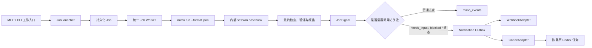

# Codex-MiMo 统一后台任务与主动通知设计

**日期：** 2026-07-16
**状态：** 已批准
**范围：** CLI、Codex MCP 工具、后台 job runtime、调用方通知与插件指导

## 背景

Codex-MiMo 当前同时存在同步 direct tool、前台 Compose、后台 Compose、`mimo_wait`、`mimo_wake` 和 heartbeat 等多条执行路径。后台任务会把大量普通进度写成 `milestone` signal，而 `mimo_wait` 遇到任意 signal 就返回。Codex 因而频繁重新调用 `mimo_wait`，每次工具轮次都会消耗上下文和 token。

现有 MiMoCode `session.post` hook 只回调 Codex-MiMo worker 内部的临时 HTTP 服务。它用于确认 MiMoCode 执行完成，并不直接通知最终调用方。调用方通知必须与内部执行 hook 分离。

## 目标

1. 所有启动 `mimo run --format json` 的入口统一创建后台 job。
2. 默认流程不再依赖 Codex 循环调用 `mimo_wait`。
3. 只在 `needs_input`、`blocked` 和终态出现时主动通知调用方。
4. 同时支持通用 webhook 调用方和 Codex Desktop 调用方。
5. 通知失败在后台重试，不改变 job 的执行结果，也不消耗 Codex token。
6. 删除被统一模型替代的同步、wake、heartbeat 和双重 resume 逻辑。
7. 保持实现通用、精简、职责单一；不保留历史兼容层、废弃别名或无效抽象。

## 非目标

- 不向调用方主动推送普通工具调用、文件读取或阶段 milestone。
- 不保留旧同步返回结构或旧工具参数。
- 不维护 `mimo_wake`、heartbeat 或前台 Compose 作为备用路径。
- 不发送原始 JSONL、完整 diff、完整 prompt 或长日志到通知载荷。

## 总体架构



### 组件职责

- `JobLauncher`：创建 job、固化调用方信息、启动 worker，并返回统一 `JobReceipt`。
- `JobDefinitionRegistry`：描述不同 job kind 的 prompt、MiMoCode 参数、写入能力和 finalize 逻辑。
- `JobWorker`：执行任意 job kind，共用进程、hook、状态、报告和错误处理。
- 内部 execution callback：接收 MiMoCode `session.post`，只证明执行完成。
- `transitionJob()`：唯一允许修改 job 状态的入口，同时负责 signal 去重和关注事件 outbox 创建。
- `NotificationDispatcher`：从 outbox 读取 delivery，并委派给目标 adapter。
- `WebhookAdapter`：向任意显式配置的 HTTP 调用方投递签名通知。
- `CodexAdapter`：恢复原 Codex thread 并启动一个处理结果的 turn。
- `mimo_events`：按需读取普通进度。
- `mimo_wait`：仅用于关注事件等待和故障诊断，不进入默认插件流程。

## Job 模型

### 状态

```ts
type JobStatus =
  | "queued"
  | "running"
  | "needs_input"
  | "blocked"
  | "completed"
  | "failed"
  | "cancelled"
  | "timeout";
```

`phase` 只描述执行中的活动，例如 `starting`、`planning`、`investigating`、`editing`、`verifying`、`reviewing` 和 `finalizing`。`phase` 不再包含 `done`、`failed` 或 `cancelled`；是否结束只由 `status` 表达。

`needs_input` 与 `blocked` 是暂停状态。对应进程已经退出或被停止，PID 被清除，但 job 保留 `sessionId`，可通过 `mimo_resume(jobId, task)` 创建子 job 继续。

### JobRecord

Job record 只保存必要信息：

- 身份：`id`、`kind`、`cwd`、`task`、`parentJobId`
- 调用方：固化后的 Codex target 或 webhook target
- 运行态：`status`、`phase`、`pid`、`sessionId`、timestamps
- 结果：`summary`、`changedFiles`、`verification`、`reportPaths`、`error`
- 文件：日志、原始事件、signals 和 notification outbox 路径

现有内部 hook 摘要字段重命名为 `executionCallback`，避免与外部调用方通知混淆。

## Job Definition Registry

六类工作通过 registry 声明差异：

```ts
interface JobDefinition<Request = unknown> {
  kind: JobKind;
  buildPrompt(request: Request): PromptTransport;
  buildMimoArgs(request: Request): string[];
  writesAllowed: boolean;
  finalize(context: JobFinalizeContext<Request>): Promise<JobOutcome>;
}
```

registry 包含 `plan`、`implement`、`review`、`fix-ci`、`resume` 和 `compose`。Job launcher、worker、状态转换、通知和结果渲染不感知具体工具类型。Compose 只保留工作流链、报告和验证规则，不再拥有独立运行时。

## 统一执行流程

每个 job 严格经过以下生命周期：

1. 持久化 request、target 和 job 元数据，状态为 `queued`。
2. 启动统一 worker，状态转为 `running`，记录 PID。
3. 运行 MiMoCode，流式记录 JSONL，并等待内部 `session.post`。
4. 捕获 diff、git 状态、验证结果和报告。
5. `classifyRunOutcome()` 根据进程、hook、验证和最终输出确定结果。
6. `transitionJob()` 更新 job、写 signal，并为关注事件创建 outbox delivery。
7. notification worker 独立投递；job worker 不等待调用方处理通知。

### 结果分类

- 最终输出明确要求补充信息：`needs_input`
- 缺少外部条件、权限、依赖或无法继续：`blocked`
- 正常完成且验证通过：`completed`
- 进程错误、内部 hook 缺失或验证失败：`failed`
- 主动取消：`cancelled`
- 执行超时：`timeout`

分类逻辑集中在 `classifyRunOutcome()`，不得散落在不同工具 handler 或 worker 中。

## 调用方解析

公共通知 target 为判别联合：

```ts
type NotificationTarget =
  | { type: "codex"; threadId: string }
  | { type: "webhook"; url: string; secretEnv: string };
```

每个 job 最多固化一个 target。“同时支持 Codex 与 webhook”表示平台支持两种 target，而不是同一个事件默认广播到两个目的地。这样可以保持调用关系明确，并避免重复通知。

解析顺序：

1. 显式 `notify` 参数
2. `CODEX_THREAD_ID` 环境变量
3. 无主动通知

显式选择 `type: "codex"` 但没有提供 `threadId` 时，仍可使用 `CODEX_THREAD_ID` 补全；两者都不存在则在创建 job 前返回输入错误。

Codex Desktop 当前会为任务进程注入 `CODEX_THREAD_ID`，用户不需要也不应在 Windows 中全局配置它。全局配置可能将多个 job 误投递到旧 thread。因为该变量尚未列入公开 Codex 环境变量文档，显式 `threadId` 始终作为稳定覆盖入口。

target 在 job 创建时固化，后台执行过程中不再重新读取环境。

## Notification Outbox

关注事件包括：

- `needs_input`
- `blocked`
- `completed`
- `failed`
- `cancelled`
- `timeout`

普通 `phase_changed` 和 `milestone` 不创建 delivery。

```ts
interface NotificationDelivery {
  id: string;
  eventId: string;
  jobId: string;
  target: NotificationTarget;
  status: "pending" | "delivering" | "delivered" | "failed";
  attempts: number;
  nextAttemptAt?: string;
  deliveredAt?: string;
  lastError?: string;
}
```

幂等键为 `jobId + signalCursor + targetKind`。Outbox 使用持久化 JSONL。notification worker 崩溃后必须从未完成 delivery 恢复，且同一 delivery 同一时刻只能由一个 worker 获取 lease。

## Webhook 协议

Webhook 只接受 `http` 或 `https` URL，并要求 `secretEnv`。job 中保存环境变量名称，不保存密钥值。

```json
{
  "version": 1,
  "eventId": "job-id:cursor:webhook",
  "event": "completed",
  "createdAt": "2026-07-16T00:00:00.000Z",
  "job": {
    "id": "job-id",
    "kind": "implement",
    "status": "completed",
    "summary": "Implementation completed."
  },
  "result": {
    "changedFiles": [],
    "verification": [],
    "reportPaths": {}
  }
}
```

HTTP header `X-Codex-Mimo-Event-Id` 携带事件 ID，`X-Codex-Mimo-Signature` 携带使用 `secretEnv` 对原始请求体计算的 HMAC-SHA256。Receiver 以 `eventId` 去重。

投递结果分类：

- 2xx：成功
- 408、429、5xx 或连接错误：瞬时失败，重试
- 其他 4xx：永久失败
- `secretEnv` 未定义或为空：永久配置失败

Webhook 载荷不包含原始日志、完整 diff、prompt、密钥或 JSONL 事件流。

## Codex Adapter

CodexAdapter 使用 Codex App Server 的 JSON-RPC 生命周期：

1. `initialize`
2. `initialized`
3. `thread/resume`
4. 等待目标 thread 没有活动 turn
5. `turn/start`

Adapter 不使用 `turn/steer`，避免把完成通知插入尚未结束的原始 turn。App Server 接受 `turn/start` 后 delivery 视为成功。

恢复 prompt 保持固定且紧凑：

```text
MiMoCode job <jobId> emitted <event>. Call mimo_result and continue handling the original request.
```

`needs_input` 和 `blocked` 额外携带精简原因。完整结果由恢复后的 Codex turn 通过 `mimo_result` 读取。

App Server 暂时不可用或 thread 正忙时属于瞬时失败；thread 不存在或无权限属于永久失败。Codex App Server 支持 thread resume 和 turn start，作为 Codex 专用适配层的正式接口基础。

## 重试与失败隔离

固定退避序列：

```text
立即 -> 10 秒 -> 1 分钟 -> 5 分钟 -> 每 5 分钟
```

瞬时失败最多重试 30 分钟。所有等待和重试发生在 notification worker，不调用 Codex，不消耗 Codex token。

通知 delivery 的最终失败不会把成功 job 改成失败。`mimo_status` 和 `mimo_result` 返回 notification 状态与最后错误。内部 `session.post` 缺失仍属于 job 执行失败，因为它是执行成功判定的一部分。

## MCP API

所有工作工具共享以下可组合选项：

```ts
interface JobOptions {
  cwd: string;
  model?: string;
  timeoutMs?: number;
  notify?:
    | { type: "codex"; threadId?: string }
    | { type: "webhook"; url: string; secretEnv: string };
}
```

工作工具只保留自身必要参数：

- `mimo_plan`：`task`
- `mimo_implement`：`task`、`allowWrite`
- `mimo_review`：`base`
- `mimo_fix_ci`：`file`、`task`
- `mimo_resume`：`jobId`、`task`
- `mimo_compose`：`workflow`、`task`、`file`、`since`、`verification` 等 Compose 必需字段

`allowWrite` 是明确写入授权，继续保留。

六个工作工具统一返回：

```json
{
  "jobId": "...",
  "kind": "implement",
  "status": "queued",
  "actions": {
    "status": "mimo_status",
    "events": "mimo_events",
    "result": "mimo_result",
    "cancel": "mimo_cancel"
  }
}
```

最终 MCP 工具集合为：

```text
mimo_healthcheck
mimo_plan
mimo_implement
mimo_review
mimo_fix_ci
mimo_resume
mimo_compose
mimo_status
mimo_events
mimo_wait
mimo_result
mimo_cancel
mimo_jobs
```

`mimo_wait` 默认过滤普通 milestone，只等待关注事件。默认插件工作流不得在创建 job 后循环调用它。

`mimo_status` 可读取任意状态。`mimo_result` 可读取 `needs_input`、`blocked` 和所有终态，以便被恢复的 Codex turn 获得暂停原因、部分结果或最终结果；它不接受仍处于 `queued` 或 `running` 的 job。

## CLI

CLI 与 MCP 共用 JobLauncher。工作命令立即返回 job receipt，并提供统一控制命令：

```text
status events wait result cancel jobs
```

内部 worker 命令统一为 `job-worker` 和 `notify-worker`。Compose 不再使用专用 `compose-worker`。

## 删除与重构范围

实现不保留兼容 shim、deprecated alias 或转发函数。明确删除：

- 前台 Compose 执行分支
- direct tool 同步 runner
- `background`、`wait` 参数及相关分支
- `mimo_wake`、heartbeat prompt 和 wake hints
- `mimo_resume_job` 及双重 resume hints
- `JobKind` 中无效的 `acp`
- Compose 专用 job worker/process 包装
- 重复的 foreground/background result renderer
- direct CLI result formatter
- 所有描述旧同步、heartbeat 和双 resume 流程的文档内容

`mimo-runner.ts`、`sessions.ts`、`compact.ts` 等文件在重构后若无引用则直接删除。删除以最终静态引用图为准，不为保留文件名而制造无意义调用。

## 测试策略

### 单元测试

- 六个工作工具只创建 job 并立即返回统一 receipt。
- `transitionJob()` 拒绝非法状态转换。
- 普通 milestone 不创建 delivery。
- 每个关注事件只创建一条幂等 delivery。
- outbox 在进程重启后恢复。
- webhook 签名、载荷、HTTP 错误分类和退避时间正确。
- target 解析遵循显式 `threadId`、`CODEX_THREAD_ID`、无通知的顺序。
- CodexAdapter 正确执行 initialize、resume、turn start 和 busy retry。
- `mimo_wait` 忽略普通进度。
- `mimo_resume` 继承 parent session 并创建子 job。
- 通知失败不改变 job 结果。
- 密钥值不进入持久化文件或日志。

### 集成测试

使用假的 MiMoCode CLI、hook receiver、webhook server 和 Codex App Server，表驱动覆盖六种 job kind 的完整链路。必须覆盖正常完成、验证失败、hook 缺失、超时、取消、需要输入、阻塞、job worker 崩溃和 notification worker 崩溃恢复。

### 插件验收

- `tools/list` 只暴露新的 13 个工具。
- 工作工具 schema 中不存在 `background` 和 `wait`。
- 不存在 `mimo_wake`、`mimo_resume_job` 或旧工具别名。
- packaged skill 不再指导 Codex 循环调用 `mimo_wait`。
- 默认 Codex 路径的 `mimo_wait` 调用次数为 0。
- job receipt 不包含日志、diff 或原始事件。
- job 完成后只恢复原 Codex thread 一次。
- webhook 可完全独立于 Codex 工作。

### Windows 实机 smoke

通过显式环境开关运行：

1. 从打包插件启动 `mimo_implement`。
2. 验证原调用立即收到 job receipt。
3. 等待 MiMoCode 完成，期间不执行 `mimo_wait`。
4. 验证 `CODEX_THREAD_ID` 对应 thread 被恢复。
5. 验证恢复 turn 调用 `mimo_result` 并汇报结果。
6. 验证不存在重复恢复 turn。

## 验证命令

```powershell
npm test
npm run build
npm run lint
npm run validate:plugin
npm run test:smoke:mimo-hooks
```

Codex 主动回推 smoke 使用独立环境开关，避免普通测试启动真实 Codex turn。旧同步接口、wake 流程和兼容别名的测试直接删除或重写。

## 完成标准

1. 所有六个 MiMoCode 工作工具和对应 CLI 命令统一创建后台 job。
2. 默认 Codex 工作流不调用 `mimo_wait` 或 heartbeat。
3. 普通进度不触发调用方 turn。
4. 关注事件通过持久化 outbox 投递给 webhook 或原 Codex thread。
5. 瞬时通知错误只在后台重试；job 结果保持独立。
6. 新工具集合、文档、插件缓存和打包产物保持一致。
7. 旧同步、wake、双 resume 和无效 ACP job 逻辑从源码与测试中消失。
8. 单元、集成、构建、类型检查、插件校验和 gated smoke 全部通过。
